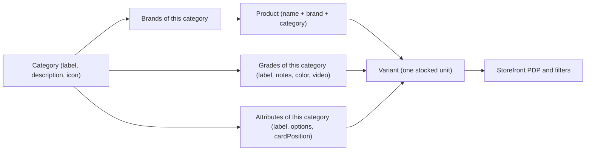
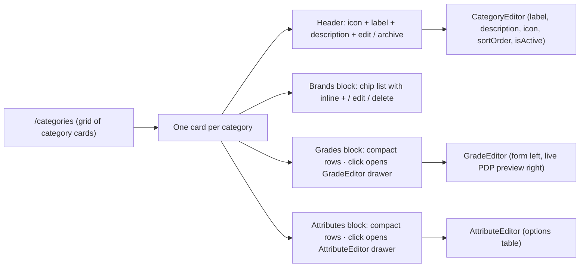
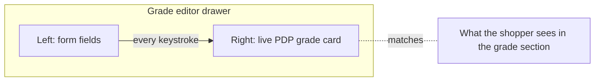
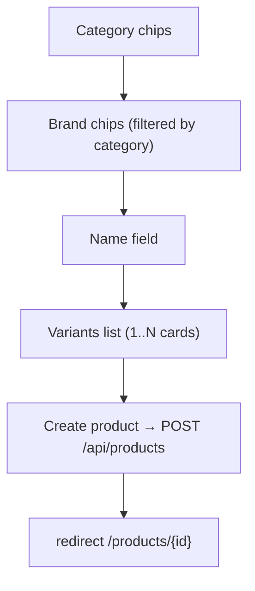
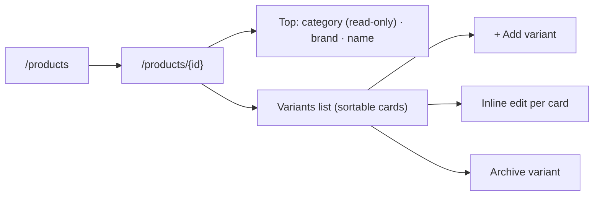
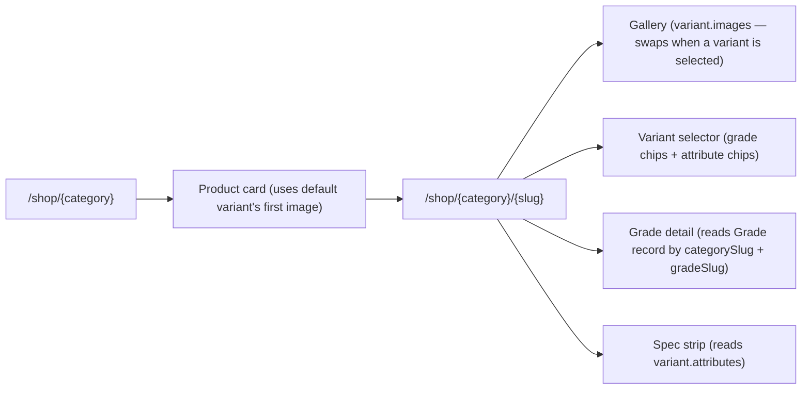
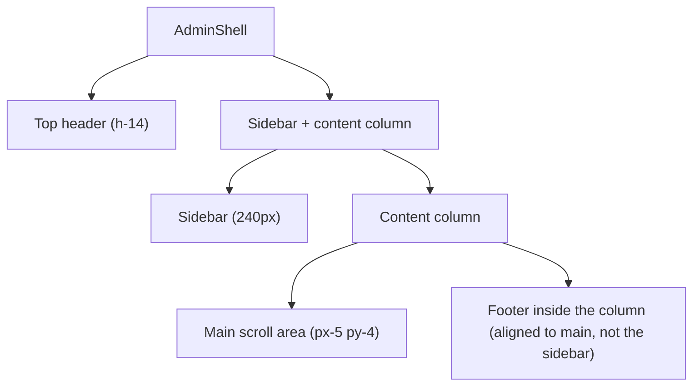
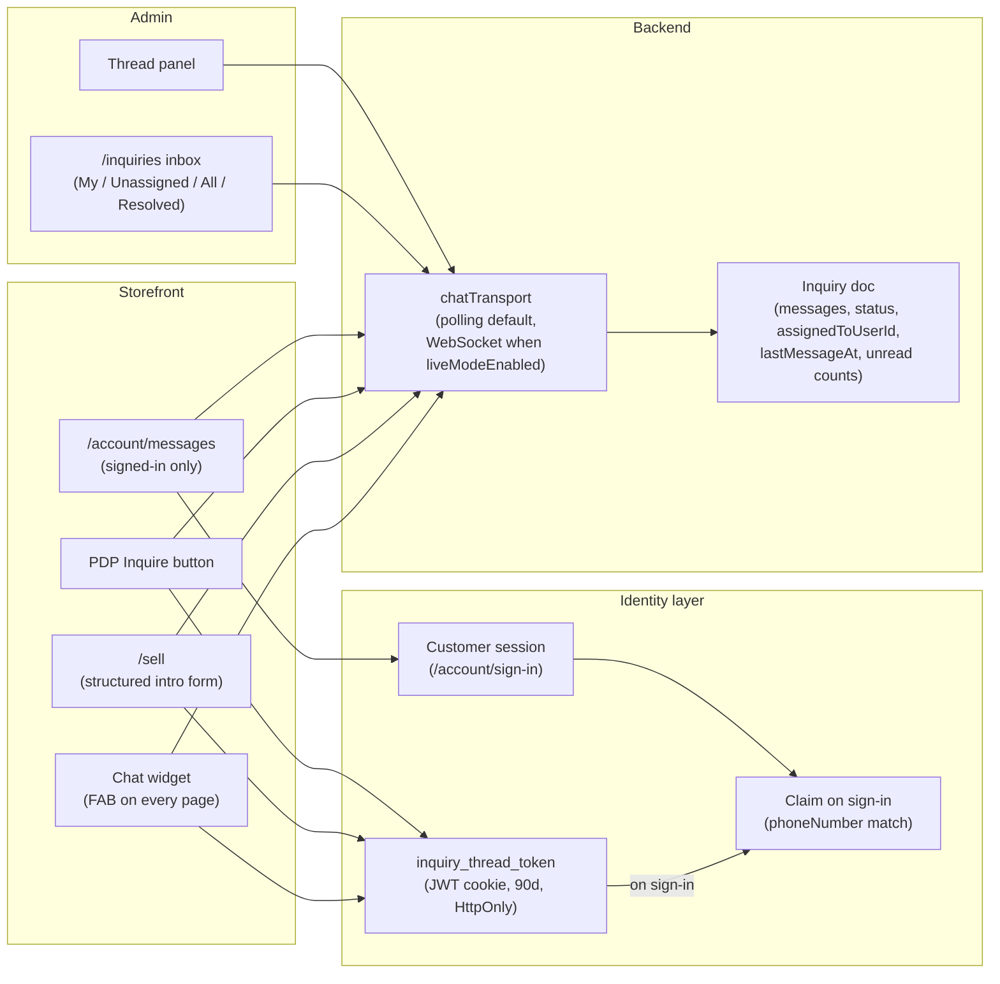
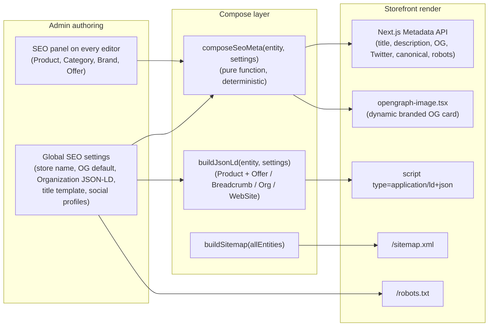

# Plan — Ibrahim Mobiles admin redesign

> A design-first plan. Read top to bottom to verify the flows, the data shape, and the major UI changes are aligned with the vision. Implementation details (file lists, migration steps) live at the bottom in appendices.

## Table of contents

1. [Locked decisions](#1-locked-decisions)
2. [The mental model](#2-the-mental-model)
3. [Flow A — Authoring a category (one page, everything inline)](#3-flow-a--authoring-a-category-one-page-everything-inline)
4. [Flow B — Authoring a grade and its PDP detail](#4-flow-b--authoring-a-grade-and-its-pdp-detail)
5. [Flow C — Creating a product](#5-flow-c--creating-a-product)
6. [Flow D — Editing a product and managing stock](#6-flow-d--editing-a-product-and-managing-stock)
7. [Flow E — Browsing and shopping (storefront alignment)](#7-flow-e--browsing-and-shopping-storefront-alignment)
8. [Admin shell, page chrome, density](#8-admin-shell-page-chrome-density)
9. [Major UI changes per admin page](#9-major-ui-changes-per-admin-page)
10. [Data shape after the refactor](#10-data-shape-after-the-refactor)
11. [Naming changes](#11-naming-changes)
12. [Chat (inquiry → threaded model)](#12-chat-inquiry--threaded-model)
13. [SEO (auto-everything with manual overrides)](#13-seo-auto-everything-with-manual-overrides)
14. [Rollout phases](#14-rollout-phases)
15. [Out of scope](#15-out-of-scope)
16. [Appendix A — Audit findings](#appendix-a--audit-findings)
17. [Appendix B — File inventory](#appendix-b--file-inventory)
18. [Appendix C — Migration and data safety](#appendix-c--migration-and-data-safety)
19. [Appendix D — Performance posture & budgets](#appendix-d--performance-posture--budgets)

---

## 1. Locked decisions

- **Image / video storage:** Vercel Blob (env `BLOB_READ_WRITE_TOKEN`). Used for product/variant images and grade demo videos.
- **Product creation UX:** single page; the form reveals progressively as the category is chosen. Variants are the only long part.
- **Create-resource route convention:** every resource that has a dedicated create page lives at `/{resource}/new`. So the product creator is `/products/new`. (Categories, brands, grades, and attributes don't get a create route at all — they're authored inline on `/categories` per Flow A.)
- **Slugs are auto-generated** on every entity (Category, Brand, Grade, Attribute, Product) from `label` / `name`. Admins never type a slug.
- **Dashboard:** untouched. One unrelated bug fix is in scope (mobile dashboard uses `.app-section` classes that exist on the storefront, not on admin).
- **Stage:** admin first. Storefront PDP gets the minimum changes needed to keep the customer flow correct after the data-shape change; nothing else on the storefront is touched.
- **Rules update:** the central rule-set at `/Users/macbook/Github/vibeCodingRules/` gained a **Dead Field Policy** in `database.md` (the schema parallel of the existing Dead File Policy). Future audits — including the Phase 1 prune in this project — execute against that policy. Also makes explicit that ORM-managed fields (`createdAt` / `updatedAt`, `id` / `_id`) are never declared in interfaces.
- **Chat plugin:** the `Inquiry` collection becomes the project's on-platform chat thread (storefront widget + `/account/messages` for signed-in history + `/inquiries` admin inbox). One unified system; no separate `Conversation` model is reintroduced. Customer identity is **guest-with-claim** (anonymous + cookie token, claims onto a customer record on sign-in by phone-number match). Transport is **polling by default, opt-in WebSocket** behind a `chat.liveModeEnabled` setting for the EC2 migration. Assignment is **hybrid** (`assignedToUserId` exists for "My inbox" filtering but anyone with `inquiry_manage` can reply; first reply auto-assigns on unassigned threads). Off-platform "channels" (WhatsApp / phone / Facebook / Instagram / walk-in) were never actually logged here — those entries were external links elsewhere on the storefront; the `source` enum is dropped entirely. See §12.
- **Cold start (catalog wipe):** the existing `Product`, `Brand`, `Category`, `Grade`, and `Attribute` collections are **dropped** during the Phase 1 migration. The admin recreates the entire catalog from scratch through the new authoring UIs. This is deliberate — the new mental model (category-driven, dynamic attributes, variant-centric, hex-coded grades, required grade videos) is incompatible with the current shape in ways that aren't worth field-by-field transforms when the dataset is small. **Preserved** collections: `Customer`, `Order` (snapshot-denormalized so it survives), `Inquiry`, `LoyaltyAccount`, `ActivityEntry`, `OtpCode`, `User`, `Setting`, `Offer`. **Cross-refs cleaned:** `Inquiry.subjectProductId` is nulled (the `subjectProductName` snapshot is kept so chat threads don't lose their context). Wishlist / cart references live in client-side stores; the storefront filters out unavailable products on render — no migration step needed for those.
- **Live previews everywhere — multi-surface, always-on, labelled.** Every authoring surface in the admin pairs the form with a **`<PreviewMatrix>`** panel that's visible at all times the editor is open (not behind a toggle, not collapsed by default). The matrix shows **one labelled tile per storefront surface the entity appears on** — never a single "best guess" preview. Each tile carries (1) a caption naming the storefront surface ("Appears on: filter sidebar"), (2) the actual storefront component rendering the live form state, (3) realistic neighbor context (e.g. a brand chip rendered inside a faked `ProductCard` sample so the admin sees what surrounds it), (4) a real-world dimension note where useful. Pure-presentation components live in `packages/shared/src/storefrontVisuals/`; admin wrappers swap router/session coupling for no-ops. The full entity → surface mapping (the "preview matrix") lives in **§9 → Live preview matrix**.
- **SEO is auto-by-default, override-when-needed.** Every public entity (Product, Category, Brand, Offer) carries an optional `seo` subdocument; when fields are missing, `composeSeoMeta(entity, settings)` generates them deterministically from the entity's data + global SEO settings. The storefront renders meta tags via Next.js's Metadata API, ships JSON-LD (Product + Offer + BreadcrumbList + Organization + WebSite) on every public page, auto-generates `/sitemap.xml` and `/robots.txt`, and dynamically renders branded OG images per product via Next.js `opengraph-image.tsx`. The admin gets a Rank Math-style "SEO" panel on every entity editor: title / description overrides with character counters, focus keyword input, **live SERP preview**, and a **0-100 SEO checklist score** (title length, keyword usage, alt text presence, image count, JSON-LD validity). Variant `images` lands as `StoredImage[]` from Phase 1 so image SEO + accessibility are built in from the start (each `StoredImage` carries `alt` as a first-class field; alt auto-fills on upload from `"<product name> · <grade label> · image N"`; per-image admin override available). See §10 (`StoredImage`) and §13.
- **Performance is a hard constraint, not an aspiration.** The storefront already runs on a deliberate perf stack — two-tier `cached.ts` (React `cache()` per render + `unstable_cache` 30s cross-request, tag-invalidated via `STOREFRONT_CACHE_TAG`), parallel reference-data load in the root layout, `next/font/google` self-host with `display: swap`, `dynamic = "force-dynamic"` only where pricing demands it, Suspense boundaries around secondary content, `NavigationProgress` for instant tap feedback, and a locked-down CSP. **None of this regresses.** Every phase ships with bundle-size + Lighthouse deltas measured against a baseline captured before Phase 1; every admin mutation that touches public data calls `revalidateTag(STOREFRONT_CACHE_TAG)` via `bustAdminCaches()`; every new client-side component is justified against the bundle budget. Concrete budgets, the sacred-infrastructure list, and per-phase risk mitigations live in **Appendix D**.
- **Images are pre-generated at multiple sizes; storage is provider-agnostic; the schema is universal.** Uploads aren't single files — they're `StoredImage` records carrying four pre-rendered WebP variants (`thumb 160w`, `card 480w`, `detail 1080w`, `full 2400w`) plus a base64 blurhash, plus source dimensions. **There is exactly one upload pipeline (`POST /api/uploads`) and exactly one image schema (`StoredImage`) used by every image-bearing field across every model, with no exceptions**: variant photos, category icons (when uploaded as image rather than emoji), offer banners, store logo / favicon / OG default, hero / promo images, chat attachments (Phase 8.5), user avatars if/when introduced, and anything added later. No model defines its own `imageUrl: string` field; every image field is `StoredImage` (or `StoredImage[]` when ordered). Storefront `<Image>` callsites pick the right variant for their surface (`ProductCard` uses `card`, PDP hero uses `detail`, lightbox uses `full`) and ship `placeholder="blur"` with the blurhash so users see something instantly. Variant generation runs in the upload API route via `sharp`; the original is discarded after processing. Storage sits behind a thin `StorageProvider` interface (Vercel Blob impl today, S3 / CloudFront swap is a one-file change later — the schema, upload route, and every renderer stay identical). See §10 (`StoredImage` + image-field inventory) and Appendix D § D.2 (Phase 2 risks).

---

## 2. The mental model



Plain English:

- **Category is the top layer.** It owns its brands, its grades, its attributes. Every choice downstream is scoped by it.
- **A product is just a name + brand + category** — and a list of variants. No product-level images, no product-level attributes, no highlights, no release year, no anything else. The product is a thin container.
- **A variant is the SKU.** Each variant carries its own grade, price, quantity, warranty, images, and attributes (color / storage / RAM / connector / etc.). The customer-visible image, spec strip, and badges all live on the variant.
- **Grades are per-category** and carry the rich PDP grade card content: a `label`, combined `notes` (cosmetic + functional), a custom badge `color`, and a required demo `video`.
- **Attributes are per-category, variant-scoped, options-only.** Every "extra" field is an `Attribute` with a list of `options` (no range, no boolean, no free-text). Storage, RAM, color, connector, accessory type, screen size — all options on attributes.

### What's gone after the refactor

| Was | Going away because |
|---|---|
| Variant `grade` enum locked to 6 values | Per-category `Grade` collection is the source of truth |
| `Category.applicableGrades` | Storefront reads the `Grade` collection |
| Hardcoded variant fields (`storageGb`, `ramGb`, `batteryHealthMin/Max`, `isPtaApproved`, `connector`, `wattage`, `lengthMeters`, `isGenuine`, `colorName`) | All become rows in `Attribute` with `options` |
| Hardcoded product fields (`accessoryType`, `gadgetType`, `releaseYear`) | Either become attributes or are dropped entirely |
| Product fields: `modelName`, `imageUrl`, `galleryUrls`, `highlights`, `attributes` | Product is now a thin container. `name` replaces `modelName`. Imagery moves to variants. |
| Variant fields: `originalPriceRupees`, `notes`, `isInStock` (bool), `colorName` | Replaced by `quantity: number`; color becomes an attribute; original price + notes dropped entirely |
| Grade fields: `shortLabel`, `cosmeticNotes`, `functionalNotes`, `tone` (enum), `sortOrder`, `inspectionVideoUrl` | Collapsed: notes = cosmetic + functional combined; tone enum → hex `color`; video is required (renamed `video`) |
| Attribute fields: `key`, `type`, `scope`, `sortOrder`, `unit` | Slug auto-generated; type is always single-select with options; scope is always variant |
| Category fields: manual `slug`, `pluralLabel`, `pathSegment`, `tagline`, `trustChips`, `emptyHint` | Slug is auto; `tagline` → `description`; the rest dropped. (`trustChips` were "7-day moneyback" / "Battery tested" style storefront badges — we don't ship those anymore.) |
| URL-paste textareas for images | Real Vercel Blob upload everywhere |

### Auto-generated slugs

Every slug is derived server-side from the entity's human-readable label/name at save time:

- `Category.slug` ← slugify(`label`). Unique across all categories.
- `Brand.slug` ← slugify(`name`). Unique across all brands.
- `Grade.slug` ← slugify(`label`). Unique per `(categorySlug, slug)`.
- `Attribute.slug` ← slugify(`label`). Unique per `(categorySlug, slug)`. Replaces the manual `key` field; the storefront URL filter param is the slug.
- `Product.slug` ← slugify(`name`). Unique across all products; collisions auto-suffix with `-2`, `-3`.

If the admin renames an entity, the slug stays stable (renames don't change URLs).

---

## 3. Flow A — Authoring a category (one page, everything inline)

`/categories` is the only category page. The admin never drills deeper. Everything is on one card.



### Card layout

One column on mobile, 1 col on small desktops, 2 cols ≥ 1280px. `p-4` padding because of how much each card contains.

**Card header** — single row:

- Category `icon` (optional emoji or uploaded image, 24px) · `label` (`text-[18px]`, single line) · `description` (one line, truncated, muted).
- Right side: status pill (Active / Archived), edit icon (opens `CategoryEditor` drawer), overflow menu (Archive / Restore, move sortOrder up/down).

**Brands block:**

- Chip list. One chip per brand: brand name + neutral pill, with a tiny pencil-on-hover and an "x" on hover. Pencil opens a small inline popover (just `name` + `isActive` + Delete); "x" confirms delete inline.
- Trailing `+` chip opens the same popover in "create" mode.
- Empty state: a single hint line + a `+ Add brand` button.

**Grades block:**

- Compact two-line rows: color swatch · `label` · `notes` excerpt (~60 chars) · row icons (edit, delete).
- Row click or edit icon opens the `GradeEditor` drawer (Flow B — form left, live PDP preview right).
- Trailing `+ Add grade` button.

**Attributes block:**

- Compact rows: `label` · option count · `cardPosition` chip · row icons.
- Row click opens the `AttributeEditor` drawer (label, options table with drag-sort, cardPosition, isActive).
- Trailing `+ Add attribute` button.

### Card footer

`N products in this category` and a destructive overflow option to delete the category (only enabled when product count is zero).

### Why brands are inline but grades and attributes get drawers

- **Brands** are a single name field. Chip + popover is enough.
- **Grades** carry rich PDP content (label, notes, color, video) and need the live-preview side panel.
- **Attributes** carry an options table that can be tens of rows long ("Storage" might be 6 options, "Color" might be 30). Need room.

Drawers slide in over the categories grid; the underlying grid stays visible behind a scrim so the admin keeps their place.

### Live previews on every drawer

Every drawer is split: **form on the left, always-visible `<PreviewMatrix>` on the right** (or below on mobile). The preview is driven by the in-progress form state via `useDeferredValue` — every keystroke updates it. Neighbor context inside each tile comes from real DB records loaded server-side; cold start falls back to structural-only frames.

The per-entity tile breakdown (Category → 3 tiles, Brand → 3, Grade → 4, Attribute → up to 5) is canonical in **§9 → Live preview matrix**. Don't restate it here.

The preview pane is the right ~40% of each drawer; form is the left ~60%. On mobile, drawers stack the preview above the form (collapsible). Visual fidelity matters: previews use the same React components that the storefront uses — see §1 ("Live previews everywhere") and §9 → Live preview matrix for the full mechanism.

---

## 4. Flow B — Authoring a grade and its PDP detail

The Grade editor opens as a side drawer split into two columns. Form left, live PDP preview right.



**Left column — form fields**, in this order:

1. `label` — required. Big heading on the PDP grade card and chip label on variant pickers.
2. `color` — required. Color picker producing a hex value. Replaces the old named-tone enum. Drives the badge color, the side bar on the grade card, and the variant chip tone.
3. `notes` — required. Multi-line text covering both cosmetic and functional condition (max 600 chars). Replaces the previous two separate fields.
4. `video` — required. Vercel Blob upload (mp4, ≤ 50 MB). Replaces the styled placeholder on the PDP. No demo video → can't save the grade.
5. `category` — read-only, shown as a static label "Belongs to {categoryLabel}". Always equal to the card it was opened from.

**Right column — always-visible `<GradePreview>` matrix.** Four tiles, all driven by the in-progress form state via `useDeferredValue`: (1) grade badge over a real ProductCard sample, (2) full PDP `GradeShowcase` card (the storefront's desktop layout exactly — colored top bar + label + notes + video frame playing the uploaded video), (3) filter-sidebar pill, (4) variant-chip dimming demo (in-stock + out-of-stock). Real neighbor data on populated DBs; structural frames on cold start. See §9 → Live preview matrix.

Save writes `POST/PUT /api/grades`. Slug is auto-derived from `label`; the API enforces `(categorySlug, slug)` uniqueness. Cache busted on save so the PDP picks up the new content on next render.

The Grade row's color swatch and notes excerpt on the category card reflect saved state.

---

## 5. Flow C — Creating a product

Single page at `/products/new`. Form is short until the variants kick in; the variant list is the only long part. No wizard, no Next button — the admin scrolls.



### The page top — product identity

1. **Category** — chip per category. Single-select. Picking one reveals the rest.
2. **Brand** — chips, filtered to `brand.categorySlugs.includes(category)`. Single-select. Empty state: "+ Add a brand to {category}" deep-links to that category's card on `/categories`.
3. **Name** — single text field. URL slug is derived server-side. Required.

That's the entire product-level form. Three fields. No images, no attributes, no highlights.

### The variants list

Flat list of variant cards. Each card is collapsible: collapsed shows the header `gradeLabel · Rs xx,xxx · qty N`; expanded shows the full form. Cards are drag-sortable. At least one variant required.

Inside each variant card:

- **Grade** — chips from `Grade.find({ categorySlug })`. Single-select. Required. Each chip shows the grade's label and its color swatch.
- **Attributes** — every `Attribute` for this category. Each renders as a single-select chip row (since attributes are options-only). Required if the attribute is marked `isActive`. This is where the admin picks color / storage / RAM / connector / accessory type / etc.
- **Images** — required, at least one. Drag-to-upload, drag-to-sort. First thumbnail is the variant's hero (used on product cards and as the PDP gallery hero when this variant is selected). Vercel Blob upload, same `ImageGallery` component used for grade videos.
- **Price** — selling price in rupees. Required.
- **Quantity** — integer ≥ 0. Required. Replaces the old `isInStock` boolean (in-stock is now derived as `quantity > 0`).
- **Warranty months** — number, default 6. Required.

Trailing **+ Add another variant** pill below the list.

### Live preview alongside the form

The page is split: form on the left (`max-w-3xl`), always-visible `<ProductPreview>` matrix on the right (sticky, ~380px wide on desktop, horizontal scroller on tablet, stacked below the form on mobile). The matrix shows four tiles — category listing card, PDP hero, related-rail card, search-result row — all driven by `useDeferredValue(form)`. Each expanded VariantCard additionally mounts a small inline `<VariantPreview>` matrix (variant chip in both stock states, gallery thumb strip, lightbox). Out-of-stock styling kicks in on the listing tile when every variant has quantity 0.

The preview pane is what makes "create from scratch" comfortable — the admin sees the product page taking shape with every field they fill, instead of saving-then-checking. Full per-tile breakdown lives in **§9 → Live preview matrix**.

### Save

The page footer has a single **Create product** button. It submits everything in one POST. Server validates: brand exists, category exists, each variant has a valid `gradeSlug` and all required attribute slugs, ≥ 1 image per variant. Atomic insert. Redirects to `/products/{id}` on success.

### What the admin no longer has to do

- No more two-stage "create the shell first, then add variants per grade".
- No more typing image URLs.
- No more product-level imagery / attributes / highlights / release year / accessory type / gadget type.
- No more separate "color name" field — color is just an attribute.
- No more original price field, no more variant notes.
- No more thinking about slugs.

---

## 6. Flow D — Editing a product and managing stock

`/products/{id}` mirrors the create flow but with the existing product loaded. Three top-of-page fields (category read-only on edit, brand chips, name) and the flat variant list. Quantity is the inventory surface — there is no separate stock page.



Top-right page action: **Archive product** (sets `isArchived: true`).

---

## 7. Flow E — Browsing and shopping (storefront alignment)



What changes under the hood:

- **All imagery lives on variants.** The product has no `imageUrl` or `galleryUrls`. The product card shows the default variant's first image. The PDP gallery is the selected variant's images.
- **Grade section** reads from the joined `Grade` record: title = `label`, body = `notes`, side bar + badge color = `color`, video frame plays `video`. No more hardcoded grade tone map, no more placeholder video.
- **Spec strip** reads from `variant.attributes` only. No special-cased phone/accessory fields.
- **Filter sidebar** reads from `Attribute.options` per category. No range or boolean filters — every filter is a single/multi-select on options.

Storefront copy that referenced removed fields (highlights, trust chips, category tagline) is replaced or dropped. The category-page header shows the category `description` instead of `tagline`.

---

## 8. Admin shell, page chrome, density



- **Footer alignment** — moves inside the content column so its left edge aligns with the main panel, not with the sidebar.
- **Shell padding** — outer `md:p-3` → `md:p-2`, gap `md:gap-3` → `md:gap-2`, `<main>` `md:px-8 md:py-8` → `md:px-5 md:py-4`.
- **Page-title ↔ skeleton parity** — the loading skeleton is rebuilt to match the live `PageTitle` byte-for-byte (h-7 title, `border-b pb-3`, `mt-3` follow-on). Kills the "huge headings" hydration flash.
- **`DataTable` defaults** — `pageSize: 50`, row padding `md:py-2.5`, sticky `<thead>`, new `filterBar` slot inside the toolbar, column-sort wired when `sortAccessor` is provided.
- **One consistent gap** between `PageTitle` and content body: `mt-4` everywhere.

---

## 9. Major UI changes per admin page

### Dashboard
Untouched. Mobile-only bug fix: add the missing `.app-section` / `.app-section-eyebrow` Tailwind utility classes to admin's `globals.css` (today they only exist in the storefront's).

### Products list
Compact summary cards (`p-3`, `text-[18px]`). Default 50 rows visible. Row image comes from the first variant of each product.

### Product create / edit
Replaced by the single-page flow (Flow C / D). The two-stage create flow is gone.

### Categories
A single grid page. No detail route. Each card hosts the category's brands (inline chips), grades (compact rows → GradeEditor drawer with live PDP preview), and attributes (compact rows → AttributeEditor drawer). See Flow A.

### Customers
Loyalty summary cards aligned to the products summary (`p-3`, `text-[18px]`). The loyalty visibility toggle moves into the table toolbar.

### Orders, Inquiries
Status chip filter strips move into the `DataTable` toolbar so there's only one band before the rows.

### Offers
Tighter color swatch column. Same density as the new products row.

### Team
Same density bump.

### Settings
Drop the 260px label gutter inside the settings tabs (stacked labels with a `max-w-2xl` field column). `SaveBar` horizontal padding fixed to match the tab body. Rename `initialSettings` prop to `bootstrapSettings`.

### Activity
Timeline cards become a dense table (timestamp · actor · action · target · ip). Filter chips into the toolbar.

### Live preview matrix — the rule for every authoring surface

Every editor (category drawer, brand editor, grade drawer, attribute drawer, product create page, product editor, offer editor, settings → SEO tab, settings → general/store info) mounts a **`<PreviewMatrix>`** panel beside (or below, on mobile) the form. The matrix is:

- **Always visible.** Never collapsed-by-default, never behind a "Preview" toggle. The whole reason it exists is to remove the "let me save and check the storefront" round-trip.
- **Multi-surface.** Renders **one tile per storefront surface where the entity appears** — not one preview that tries to summarise everything.
- **Labelled.** Each tile has a caption naming the storefront surface in plain English ("Appears on: PDP spec strip", "Appears on: Filter sidebar"). Admins should never have to guess what they're looking at.
- **In context — with REAL data, never hardcoded mock data.** Tiles aren't floating components; they include realistic neighbor context. When previewing a brand chip "on a product card", the surrounding `ProductCard` uses **a real recently-edited product from the database** (whichever product was most recently updated in any category the brand is linked to). When previewing a grade badge, it overlays the hero of a real product that uses that category. When previewing an attribute chip in a filter sidebar, the surrounding sidebar shows the real other attributes that exist in that category. Neighbor context is loaded server-side via `liveContextLoader.ts` (RSC) on editor mount and cached for the editor session.

  **Cold-start behavior (no real data yet):** when the database has no products / brands / grades for the relevant category (typical right after the Phase 1 catalog wipe), the tile renders **a structural-only frame** — the exact storefront layout with low-opacity placeholder text inside the neighbor slots ("Your first product will appear here", "Other brands will appear here"). We never fabricate fake products or fake brand names to fill in. The admin sees the *real shape* of the surface, never made-up data.
- **Live.** Form state flows through `useDeferredValue` (100ms debounce — see Appendix D § D.2 Phase 3) so 80wpm typing doesn't stall the form. Image fields rendered through `next/image` with `blurDataURL` so previews don't flash white during upload.
- **Dimensions noted.** Tiles that benefit from it have a tiny footer like "~80×40 px on mobile" or "Renders at 240px wide" so the admin understands the on-screen size.

**The matrix per entity:**

| Authored entity | Preview tiles shown in the editor |
|---|---|
| **Category** | (1) **Homepage category-grid card** — the big rounded card with icon + label + product count, as it appears on `/shop`. (2) **Category landing-page header** — the hero strip at the top of `/shop/[category]` with description + product count. (3) **Nav menu chip** — the small category link as it shows in the storefront header dropdown. |
| **Brand** | (1) **Brand chip on `ProductCard`** — wrapped inside a faked product card so the admin sees the chip in context. (2) **Filter sidebar row** — the brand checkbox + name as it appears in `<FilterSidebar>`. (3) **Brand chip on PDP breadcrumb** — small inline pill above the product name. |
| **Grade** | (1) **Grade badge on `ProductCard`** — corner badge over a sample hero photo, tinted by `grade.color`. (2) **PDP `GradeShowcase` card** — the full "Grade · {label}" section with notes + color swatch + video poster (showing the existing storefront layout from `GradeShowcase.tsx`). (3) **Filter sidebar grade row** — the grade pill in the filter group. (4) **Variant chip dimming preview** — a sample variant chip showing how this grade looks when applied + when out of stock. |
| **Attribute** | (1) **PDP spec strip chip** — how the attribute renders in the dynamic spec strip when a variant has a value set. (2) **`ProductCard` image overlay** (only when `cardPosition: "image-overlay"`) — chip overlaid on the hero corner. (3) **`ProductCard` title chip** (only when `cardPosition: "title-chips"`) — chip rendered next to the product name. (4) **Filter sidebar attribute group** — the full `<AttributeFilterGroup>` with all options as checkboxes. (5) **Variant selector chip** — for attributes that drive variant differentiation (storage, color), shows a faked variant-chip strip using the attribute's options. |
| **Product** (create / edit) | (1) **`ProductCard` in category listing** — full card with hero, brand chip, name, lowest in-stock price, grade badge. Updates as variants are added/changed. (2) **PDP hero** — the top of `/shop/[category]/[slug]` with gallery, name, brand, price, variant selector, dynamic spec strip. (3) **Related-rail card** — same `ProductCard` rendered at the smaller related-rail width so admins see the lazy-loaded card surface too. (4) **Search-result row** — single-line dense listing as it would appear in storefront search. |
| **Variant** (inline inside the product editor) | (1) **Variant chip in PDP selector** — the chip with grade tint + price + stock pip; in-stock vs out-of-stock states both rendered so the admin sees the dimming. (2) **Variant-specific gallery** — strip of `StoredImage.variants.thumb` previews, scrolling. (3) **Lightbox preview** — `StoredImage.variants.full` rendered at lightbox size when the admin clicks a thumb. |
| **Offer** | (1) **Promo banner on home** — the offer's title + discount label + accent color, rendered as the storefront's hero banner. (2) **Offer chip on related products** — the small offer pill as it surfaces on `ProductCard` when an offer is active. (3) **Offer landing-page hero** (if/when offers get landing pages). |
| **Settings → Store info** | (1) **Storefront header logo + store name** — top-of-page chrome. (2) **Footer block** — store name + tagline + social links. (3) **PDP "About" callout** — wherever store info appears in checkout / about. |
| **Settings → SEO tab** | Live SERP preview + the OG image source preview (see §13.7); already specced. |
| **Settings → Chat** | (1) **FAB shell** — what the floating button looks like with the current colors + position. (2) **EmptyState form** — exactly what guests see when they click the FAB, including the "Full name" label per §12. |

**Implementation note.** Each editor wires the matrix via a thin `<*Preview>` component under `apps/admin/src/components/previews/` (e.g. `BrandPreview.tsx`, `GradePreview.tsx`, `AttributePreview.tsx`, `ProductPreview.tsx`, `OfferPreview.tsx`, `CategoryPreview.tsx`, `VariantPreview.tsx`). Each preview composes 2–5 tiles drawing from `packages/shared/src/storefrontVisuals/`.

**Neighbor data flow:** the editor's RSC page component imports **`liveContextLoader.ts`** (server-only) and calls e.g. `await loadBrandNeighborContext({ brandSlug, categorySlugs })`. The loader returns a small bundle: the most-recently-updated real product/category/brand/grade/attribute records relevant to whatever's being authored. This bundle is passed as a prop down to the client `<BrandPreview>` and used as the surrounding context inside the matrix tiles. The **entity being authored** is *always* rendered from the live form state — only neighbor slots use the real loaded data. When the loader returns empty results (cold start, fresh catalog), preview tiles fall back to structural-only frames defined in `packages/shared/src/storefrontVisuals/structuralFrames.tsx` — these render the storefront layout shell with low-opacity placeholder text instead of made-up content.

See Appendix B for the file inventory and TASKS.md Phase 3 / Phase 4 / Phase 5 for the per-editor wiring tasks.

---

## 10. Data shape after the refactor

> **Policy reference.** Field cuts in this section apply `vibeCodingRules/database.md` § **Dead Field Policy**: every column that no production reader / writer / serializer references is removed in the same commit that drops its last caller (or in the immediately-following migration commit). Enum tails are emptied via backfill *before* the enum is tightened.
>
> **Timestamps are universal and never declared.** Every schema sets Mongoose `{ timestamps: true }` and that's the only place `createdAt` / `updatedAt` exist. The interfaces below intentionally omit them — they're runtime metadata, not authored fields. The same goes for `_id` on top-level documents. (See `database.md` § Dead Field Policy → "Framework-Managed Fields".)

### Shared: SeoMeta subdocument

Used by Category, Brand, Product, Offer (any entity with a public storefront page). All fields are optional — when missing, `composeSeoMeta(entity, settings)` derives them. See §13.

```ts
interface SeoMeta {
  title?: string;               // manual override of the auto title
  description?: string;         // manual override of the auto description
  canonicalUrl?: string;        // manual override (e.g. point variant pages at parent)
  ogImageUrl?: string;          // manual override (defaults to entity hero image or dynamic OG)
  focusKeyword?: string;        // used by the SEO checklist + score
  noindex?: boolean;            // default false
  nofollow?: boolean;           // default false
}
```

### Shared: StoredImage subdocument

**Used by every image-bearing field across every model — universal, no exceptions.** Generated by the single upload route (`POST /api/uploads`) in one pass using `sharp`; storage URLs are provider-agnostic. See Phase 2 (TASKS.md) for the upload pipeline.

**Image-field inventory** (every place `StoredImage` is referenced — if a future model adds an image field, it adds to this list):

| Model | Field | Type | Notes |
|---|---|---|---|
| `Variant` | `images` | `StoredImage[]` | Required, ≥1, ordered (index 0 = hero). Alt auto-fills from `"<product name> · <grade label> · image N"`; admin can override per image. |
| `Category` | `icon` | `string \| StoredImage` (discriminated by `iconKind: "emoji" \| "image"`) | When emoji, just a unicode string; when image, a `StoredImage`. The renderer picks variants by `card` for the grid and `thumb` for nav. |
| `Offer` | `bannerImage` | `StoredImage?` | Optional. Renders at `detail` width on the home banner, `card` on related-product chip. |
| `Setting` (`store.logo`) | — | `StoredImage?` | Header logo. Renders at `thumb` everywhere (header is small); `card` for OG-image fallback. |
| `Setting` (`store.favicon`) | — | `StoredImage?` | Special-case: the upload route still produces all 4 variants but only `thumb` is wired into the `<link rel="icon">` (Next.js prefers 32×32; we use the `thumb` 160w as the source and let the browser scale). |
| `Setting` (`seo.ogImageDefault`) | — | `StoredImage?` | The fallback OG image when no product-specific OG image is generated. Renders at `detail` (1080w aligns with the OG image spec of 1200×630). |
| `Inquiry.messages[i].attachments[]` (Phase 8.5) | — | `StoredImage[]` | Chat attachments. Renders at `thumb` inline in the chat bubble, `full` in lightbox. Non-image attachments (PDFs, etc.) skip the pipeline entirely and store raw URL + mime — but image attachments go through `StoredImage`. |
| `User.avatar` (if/when introduced) | — | `StoredImage?` | Reserved. No avatar field exists today; this row documents the policy so the day it's added it follows the schema. |

**Rule that's mechanically checked:** the lint sweep in TASKS.md T1.20 fails the build if any model interface declares a field that ends in `Url`, `ImageUrl`, `LogoUrl`, `IconUrl`, `BannerUrl`, etc. and isn't either (a) a non-image URL like `videoUrl` or `socialUrl`, or (b) explicitly typed as `StoredImage`. This kills raw image-URL strings at the type level.

**Single upload pipeline:** every admin uploader — `ImageGallery` (variants), `ImageUpload` (single, used by Category icon picker, Settings logo/favicon/OG, Offer banner), chat attachment picker — calls **the same** `POST /api/uploads` route, which always returns a `StoredImage`. There is no second uploader, no per-entity bespoke handler.

```ts
interface StoredImage {
  variants: {
    thumb: string;              //  160w WebP — admin gallery thumbs, hero badges, OG-card collage
    card: string;               //  480w WebP — storefront ProductCard, related rail
    detail: string;             // 1080w WebP — PDP hero on tablet/desktop, dynamic OG image input
    full: string;               // ≤ 2400w WebP — lightbox / zoom view (original if smaller)
  };
  blurDataURL: string;          // 32×32 base64-encoded blur (~200 bytes); ships inline in HTML for instant placeholder
  width: number;                // SOURCE dimensions (full size) — needed by next/image to prevent CLS
  height: number;
  alt: string;                  // accessibility / SEO alt text; auto-filled on upload, admin-editable per image
}
```

Reasons for this shape:

- **Storage-agnostic.** The `variants.*` fields are plain HTTPS URLs. Today they point at `*.public.blob.vercel-storage.com`; swap the underlying `StorageProvider` and they point at `cdn.<domain>` backed by S3 + CloudFront. Schema, upload route, and every renderer don't change.
- **No on-the-fly optimization needed.** Every URL is already the right size for its consumer. CDN cache hit ratio approaches 100% because there are no `?w=480&q=75` query-string variants — every product card across the site uses the same `card` URL.
- **Instant perceived load.** `blurDataURL` is ~200 bytes, inlines into the HTML, paints immediately, the real image fades in. Mobile LCP win.
- **Predictable bytes.** The largest variant the storefront ever serves is `full` at ≤ 2400w — even a 4K admin upload gets capped during processing. No surprise 4 MB image hits from a marketing-team upload mishap.

### Category

```ts
interface Category {
  slug: string;                 // auto-generated from label, unique
  label: string;                // required
  description: string;          // required (replaces tagline)
  iconKind: "emoji" | "image";  // required — discriminator for icon storage
  iconEmoji?: string;           // present iff iconKind === "emoji" — unicode char
  iconImage?: StoredImage;      // present iff iconKind === "image" — uploaded image; see Shared: StoredImage
  sortOrder: number;
  isActive: boolean;
  seo?: SeoMeta;
  // GONE: pluralLabel, pathSegment, tagline, trustChips, emptyHint, applicableGrades, manual slug, single icon string
}
```

### Brand

```ts
interface Brand {
  slug: string;                 // auto-generated from name, unique
  name: string;                 // required
  categorySlugs: string[];      // ≥1 required
  sortOrder: number;
  isActive: boolean;
  seo?: SeoMeta;
  // GONE: tagline (unused on the storefront; cut for simplicity)
}
```

### Grade

```ts
interface Grade {
  categorySlug: string;         // required
  slug: string;                 // auto-generated from label; (categorySlug, slug) unique
  label: string;                // required
  notes: string;                // required (replaces cosmeticNotes + functionalNotes)
  color: string;                // required hex (replaces tone enum)
  video: string;                // required Vercel Blob URL (replaces inspectionVideoUrl)
  // GONE: shortLabel, cosmeticNotes, functionalNotes, tone enum, sortOrder, inspectionVideoUrl (renamed)
}
```

### Attribute

```ts
interface Attribute {
  categorySlug: string;         // required
  slug: string;                 // auto-generated from label; (categorySlug, slug) unique. Replaces the manual `key`.
  label: string;                // required
  options: { value: string; label: string }[];  // required, ≥1
  cardPosition: "image-overlay" | "title-chips" | "none";  // required
  isActive: boolean;
  // GONE: key (auto), type (always single-select), scope (always variant), sortOrder, unit
}
```

### Product

```ts
interface Product {
  slug: string;                 // auto-generated from name, unique
  name: string;                 // required (was modelName)
  brandId: ObjectId;            // required
  category: string;             // category slug, required
  isActive: boolean;
  isArchived: boolean;
  isFeatured: boolean;
  variants: Variant[];          // ≥1 required at create time
  seo?: SeoMeta;
  // GONE: imageUrl, galleryUrls, highlights, attributes, accessoryType, gadgetType, releaseYear, modelName (renamed)
}
```

### Variant

```ts
interface Variant {
  gradeSlug: string;            // required, references Grade for the product's category
  priceRupees: number;          // required
  quantity: number;             // required, integer ≥ 0
  warrantyMonths: number;       // required, default 6
  images: StoredImage[];        // required, ≥1, ordered (index 0 = hero). Each entry carries 4 pre-rendered WebP variants + blurhash + dimensions + alt. Alt auto-fills on upload from "<product name> · <grade label> · image N"; admin can override per image. See StoredImage above.
  attributes: Record<string, string>;  // attributeSlug → chosen option value. Single-select only; multi-select attributes are not supported in this iteration (see §15 Out of scope). Includes color, storage, RAM, connector, etc.
  // Derived at serializer time, never stored: isInStock = quantity > 0.
  // GONE: originalPriceRupees, notes, imageUrls (renamed to images), colorName (now an attribute),
  //       storageGb, ramGb, batteryHealthMin/Max, isPtaApproved, connector, wattage, lengthMeters, isGenuine
  //       (all migrated into attributes), isInStock (was a stored boolean — now derived from quantity)
}
```

### Other models — dead-field cuts

These are the result of a `git status`-aware pass over every model in [packages/db/src/models/](packages/db/src/models). Only entries that change ship in this plan; the rest are confirmed clean.

**[User.ts](packages/db/src/models/User.ts) — drop the three legacy role aliases.** `USER_ROLES` still ships `"manager"`, `"staff"`, `"media_manager"` for read-back compatibility. The bootstrap migration already rewrites them to their modern equivalents (`business_manager`, `support_staff`, `product_manager`). With the migration marker in place, the aliases are dead enum values.

```ts
// Before
const USER_ROLES = [
  "owner", "business_manager", "product_manager", "marketing_manager", "support_staff",
  "manager", "staff", "media_manager",   // legacy — drop
] as const;

// After
const USER_ROLES = [
  "owner", "business_manager", "product_manager", "marketing_manager", "support_staff",
] as const;
```

**[ActivityEntry.ts](packages/db/src/models/ActivityEntry.ts) — drop dead resource types.** `ACTIVITY_RESOURCE_TYPES` still includes `"media"` and `"conversation"`, but both features are deleted in your working tree (`git status` shows `D apps/admin/src/app/api/media/...` and `D .../api/conversations/...`). No new entries are ever written with those values; old entries can stay readable by reading the field as `string` rather than enum during deserialization, or be back-filled to `"settings"`/`"team"`.

```ts
// Before
const ACTIVITY_RESOURCE_TYPES = [
  "product", "brand", "category", "grade", "attribute",
  "order", "customer", "loyalty", "inquiry", "offer",
  "media", "conversation",                // dead
  "team", "settings", "auth",
] as const;

// After
const ACTIVITY_RESOURCE_TYPES = [
  "product", "brand", "category", "grade", "attribute",
  "order", "customer", "loyalty", "inquiry", "offer",
  "team", "settings", "auth",
] as const;
```

**[Offer.ts](packages/db/src/models/Offer.ts) — same treatment as Grade got.**

- `accentColor` enum (`emerald`, `amber`, `rose`, `sky`) → hex `color` string, picked via the same color picker as Grade.
- `slug` becomes auto-generated from `title`, never typed.

```ts
// After
interface Offer {
  slug: string;                  // auto from title
  title: string;
  description: string;
  discountLabel: string;
  badgeLabel: string;
  color: string;                 // hex (was accentColor enum)
  bannerImage?: StoredImage;     // optional — home promo banner background; see Shared: StoredImage above
  expiresAt?: Date;
  isActive: boolean;
  sortOrder: number;
  seo?: SeoMeta;
}
```

**[Inquiry.ts](packages/db/src/models/Inquiry.ts) — major rewrite for the chat plugin.** See §12 for the full chat subsystem. The new shape, in summary:

```ts
const INQUIRY_STATUSES = ["open", "awaiting-customer", "resolved"] as const;
const INQUIRY_MESSAGE_AUTHORS = ["customer", "agent"] as const;

interface InquiryMessage {
  _id?: ObjectId;
  author: "customer" | "agent";
  authorUserId?: ObjectId;       // present iff author === "agent"
  authorName: string;            // denormalized snapshot
  body: string;
  attachments?: Array<           // Phase 8.5; field shape ships in Phase 1 so no second schema migration
    | { kind: "image"; image: StoredImage }
    | { kind: "file"; url: string; mime: string; sizeBytes: number; filename: string }
  >;
  createdAt: Date;
  readByCustomerAt?: Date;
  readByTeamAt?: Date;
}

interface Inquiry {
  customerId?: ObjectId;         // populated via session OR guest-claim
  customerName: string;
  phoneNumber: string;           // identity anchor
  subjectProductId?: ObjectId;   // PDP "Inquire about this"
  subjectProductName?: string;   // denormalized snapshot
  status: "open" | "awaiting-customer" | "resolved";
  assignedToUserId?: ObjectId;
  messages: InquiryMessage[];
  lastMessageAt: Date;
  lastMessagePreview: string;    // ≤ 140 chars
  lastMessageAuthor: "customer" | "agent";
  unreadByCustomer: number;
  unreadByTeam: number;
  internalNotes?: string;        // admin-only, never serialized to customer
}
```

Fields dropped: `modelName`, `variantSummary`, `expectedRupees`, `source`, `receivedAt`, `lastMessage`, `customerCity`, `productId` (renamed `subjectProductId`), `notes` (renamed `internalNotes`). Status values `new` / `in-progress` / `won` / `lost` all collapse to `open` or `resolved`.

**[Customer.ts](packages/db/src/models/Customer.ts), [Order.ts](packages/db/src/models/Order.ts), [LoyaltyAccount.ts](packages/db/src/models/LoyaltyAccount.ts), [OtpCode.ts](packages/db/src/models/OtpCode.ts), [Setting.ts](packages/db/src/models/Setting.ts) — confirmed clean.** Their "duplicated" fields are deliberate snapshots (an order must remember what it looked like at the moment it was placed). Denormalized values are kept for filter/sort performance, not by accident. (Setting gains six new `chat.*` keys for the chat subsystem — see §12.4.)

---

## 11. Naming changes

| Where | Pattern | Action |
|---|---|---|
| `apps/admin/src/components/` | `CustomersView.tsx` + orphan `Customers.tsx` (and same for Orders/Inquiries/Offers/Team/Settings) | Delete the orphan. Rename the survivor to drop `View`. |
| `apps/admin/src/components/categories/` | Three orphan duplicates (`Categories.tsx`, `CategoryWorkspace.tsx`, `CategoryEditor.tsx` — last one exports the wrong symbol); a detail-route component (`CategoryDetailView.tsx`) that the new design doesn't need | Delete all four. The grid page hosts everything (Flow A). |
| `apps/admin/src/components/categories/CategoryDrawer.tsx` | Mixes four editors under a UI-suffix name | Split into `CategoryEditor.tsx`, `BrandEditor.tsx`, `GradeEditor.tsx`, `AttributeEditor.tsx`. Each opens inside the design-system `Drawer`. |
| `apps/admin/src/app/categories/[slug]/page.tsx` | Detail route the new design doesn't need | Delete. |
| `apps/admin/src/components/ProductEditor.tsx` (internal `VariantDrawer`) | UI-suffix on a resource-bound editor | Extract to `apps/admin/src/components/products/VariantEditor.tsx`. |
| `apps/web/src/components/shared/` | `AccessoryDetail.tsx` (orphan) + `AccessoryDetailView.tsx` (used) | Delete orphan, drop `View` suffix. |
| `apps/web/src/components/shared/` | `CompareVariants.tsx` + `CompareVariantsModal.tsx` (duplicate) | Keep one file as `CompareVariants.tsx`. |
| `apps/web/src/components/{account,cart,checkout,wishlist,layout}/` | Same `*View` / `*Sheet` orphan-pair pattern | Delete the orphan half, rename the survivor without the suffix. |
| `SettingsView` prop / state | `initialSettings`, `draft` | `bootstrapSettings`, `settingsDraft`. |
| `team/page.tsx` + callers | `currentUserId`, `isCurrentUserOwner`, `currentUserPermissions` | `viewerUserId`, `isViewerOwner`, `viewerPermissions`. |

Kept on purpose:

- `Drawer.tsx`, `Modal.tsx`, `Sheet.tsx`, `Card.tsx` in design-system folders — primitives keep mechanism names.
- `lib/initials.ts` — "initials" is a real domain noun, not a lifecycle prefix.
- `/products/new` URL — idiomatic Next.js / Rails / Phoenix convention for "the create form for this resource". The component bound to that route is named `CreateProduct` (action verb), keeping the URL convention and the component naming convention both intact.

---

## 12. Chat (inquiry → threaded model)

The existing `Inquiry` collection becomes the project's on-platform chat plugin. **One unified system.** Customer talks to the team through a floating widget on every storefront page (plus a dedicated `/account/messages` page for signed-in history); team replies through the existing `/inquiries` admin page reshaped as an inbox. No second model is introduced. The previously-deleted `Conversation` model is not coming back.

### 12.1 Mental model



Three load-bearing principles:

1. **One thread per phone number.** A second message from the same phone lands in the existing inquiry. New threads are created only on first contact from a phone.
2. **Default polling, opt-in WebSocket.** A `chat.liveModeEnabled` setting in the existing `Setting` collection flips the transport at runtime. When `false` (default; Vercel-friendly) both ends poll. When `true` and a `chat.websocketUrl` is configured (post-EC2 migration) clients open a WebSocket; polling stays as the automatic fallback.
3. **Hybrid assignment.** `assignedToUserId` is for "My inbox" filtering and ownership signalling; it does NOT gate replies. Anyone with `inquiry_manage` can reply to any thread. First reply on an unassigned thread auto-assigns the replier.

### 12.2 Identity — guest-with-claim

Customers can chat without signing in. Identity is anchored on `phoneNumber`.

**Guest path.**

- Customer opens the widget on any storefront page.
- Widget prompts for **full name** + `phoneNumber` once (no city — that was legacy /sell-form clutter). The field is labelled "Full name" with placeholder text like "e.g. Ahmed Khan" so customers understand we want both first and last name — this is what admins will see in the inbox and reply to. We don't strictly require a space (single-name customers exist) but do require ≥ 2 non-whitespace characters after trim, and Unicode-friendly so Urdu / non-Latin names work (`/^[\p{L}\p{M}\s.'-]+$/u`). Stored in `Inquiry.customerName`.
- `POST /api/storefront/inquiries/start` creates an Inquiry with the phone number, leaves `customerId` empty.
- Server responds with `Set-Cookie: inquiry_thread_token=<JWT>; HttpOnly; SameSite=Lax; Max-Age=7776000`. JWT payload: `{ inquiryIds: ["..."], phoneNumber, iat, exp }`.
- Subsequent reads / posts from that browser carry the cookie; server verifies it and authorises against the embedded `inquiryIds`.

**Signed-in path.**

- Customer is signed in at `/account`.
- Widget skips the name/phone prompt — it uses the customer session.
- New Inquiry is created with `customerId` populated; no guest cookie is set.

**Claim flow.**

- On successful customer sign-in (or registration), run once:
  ```
  Inquiry.updateMany(
    { phoneNumber: <customer.phoneNumber>, customerId: null },
    { $set: { customerId: <customer._id> } }
  )
  ```
- Guest threads created from this browser are now linked to the account and visible at `/account/messages`. The cookie stays valid but the session is preferred.

**Edge case.** Customer chats as a guest with phone A, signs in with phone B. Threads for A do NOT claim to B (phone mismatch — phone is identity, not the cookie). The cookie still works for resuming phone-A's threads in the same browser, but they won't appear under the signed-in account's history. That's intentional.

### 12.3 Data model

See §10 for the canonical interface. Key shape changes from today's `Inquiry`:

- `messages: InquiryMessage[]` array replaces the singular `lastMessage` string.
- `status` enum collapses to `open | awaiting-customer | resolved` (drop `new` → `open`, `in-progress` → `open`, `won` / `lost` → `resolved`).
- `phoneNumber` becomes the identity anchor; indexed for claim queries and new-message routing.
- `customerId` is now populated whenever session or claim provides it.
- `subjectProductId` (renamed from `productId`) + denormalized `subjectProductName` for PDP context.
- `lastMessageAt` / `lastMessagePreview` / `lastMessageAuthor` denormalized for inbox sorting and list rendering without loading every thread's messages.
- `unreadByCustomer` / `unreadByTeam` counters for badge rendering.
- `internalNotes` (renamed from `notes`) to make admin-only read scope explicit.

Indexes:

```
{ phoneNumber: 1 }                        // identity / claim / new-message routing
{ status: 1, lastMessageAt: -1 }          // admin inbox sort
{ assignedToUserId: 1, status: 1 }        // "My inbox" filter
{ customerId: 1, lastMessageAt: -1 }      // /account/messages list
```

### 12.4 Transport layer (polling default, WebSocket opt-in)

A small client module `chatTransport.ts` (shared between `apps/web` and `apps/admin`) picks transport at runtime:

```
function createChatTransport(opts):
  if settings.chat.liveModeEnabled === true AND settings.chat.websocketUrl is set:
    → open WebSocket to <websocketUrl>/<scope>
    → on first frame: cancel polling, run on WS only
    → on disconnect / error: resume polling, retry WS every 30s with jitter
  else:
    → polling-only mode
    → focused tab: poll every chat.pollIntervalMsFocused (default 5000ms)
    → blurred tab: poll every chat.pollIntervalMsBlurred (default 30000ms)
    → on visibilitychange: immediate refetch, then adjust interval
```

The polling endpoint is always live. WebSocket is purely opt-in.

**Polling endpoints (always available):**

```
GET /api/storefront/inquiries/:id?since=<iso>
  → 200 { thread, newMessages } if changes since <iso>
  → 304 if no changes (cheap)

GET /api/inquiries?filter=mine|unassigned|all|resolved&since=<iso>
  → admin inbox deltas
```

**WebSocket endpoints (opt-in, post-EC2):**

```
WSS  <websocketUrl>/inquiry/:id     // one socket per open thread
WSS  <websocketUrl>/inbox           // admin-only inbox broadcast
```

Both deliver the same payload shape as the polling response. Server-side authorization on upgrade is identical (cookie / session / inquiry-token check).

**Settings (new `chat.*` keys in the existing `Setting` collection, surfaced as a new "Chat" tab on the Settings page):**

| Key | Default | Effect |
|---|---|---|
| `chat.enabled` | `true` | **Master kill switch.** When `false`, the storefront ships zero chat-widget markup and zero widget JavaScript (the FAB shell returns `null` early). Lets admins disable chat globally for maintenance / promo mode / EC2 transition. See Appendix D § D.2 Phase 8 Risk #3. |
| `chat.liveModeEnabled` | `false` | When `true` AND `chat.websocketUrl` is set, clients attempt WebSocket. |
| `chat.websocketUrl` | `""` | Base `wss://` URL for the broker. Empty disables WS even when liveModeEnabled is true. |
| `chat.pollIntervalMsFocused` | `5000` | Foreground poll interval. |
| `chat.pollIntervalMsBlurred` | `30000` | Background poll interval. |
| `chat.guestThreadTokenDays` | `90` | Lifetime of the `inquiry_thread_token` cookie. |
| `chat.attachmentsEnabled` | `false` | Gates image/file upload in chat (flips on once the Vercel Blob route lands — Phase 2). |

### 12.5 Storefront UI

**Floating chat widget (every storefront page).**

- Fixed-position FAB bottom-right, 56×56 round button with chat icon. Red badge when `unreadByCustomer > 0`. Hidden on `/account/sign-in` and `/checkout` to avoid layout collisions.
- Click → panel slides up. 380 × 560 on tablet+, fullscreen sheet on `<640px`.
- Empty state (no thread yet for this browser): "Hi — how can we help?" + **Full name** input + phone input + first-message textarea + Send. The full-name field is labelled "Full name" (not just "Name") with a placeholder like "e.g. Ahmed Khan" — admins reply to this name, so we make the expectation explicit. Validation: trim, ≥ 2 chars, Unicode-friendly letters/marks/spaces (allows Urdu, hyphenated names, etc.). On send: creates Inquiry, sets cookie, switches to thread view.
- Thread state: header (store name + open/closed badge driven by a future `chat.businessHours` setting), message list (customer right-aligned, agent left with avatar circle), composer at bottom. Status banner when resolved: "This conversation was marked resolved. Reply to reopen."
- Widget UI state cached in `localStorage` (open/closed, last-read marker) so it survives reloads.

**`/account/messages` (signed-in only).**

- Two-pane layout: sidebar list of threads (sorted by `lastMessageAt` desc; unread dot, time-ago, preview) + right pane with the selected thread.
- No name/phone prompt — session provides identity.
- "Start a new conversation" button creates an empty-subject thread.
- Same composer / message-list components as the widget; just bigger.

**PDP "Inquire about this" button.**

- Replaces today's hidden inquiry form.
- Click → opens the widget pre-seeded with `subjectProductId` and a placeholder body: `"Hi, I'd like more info on <Product name>"`. Customer edits before sending.

**`/sell` page.**

- Stays as a structured form (name, phone, model, expected price, message) — it's a known conversion funnel.
- On submit: creates an Inquiry whose `messages[0]` is the structured content rendered as a formatted text block:

  ```
  Sell request

  Model: iPhone 14 Pro
  Expected price: Rs 200,000

  Message: Looking to sell, condition is good, with box.
  ```

- After submission, redirects to `/account/messages/<id>` (if signed in) or to a thank-you page with a "Continue chat" link that opens the widget against the just-set cookie.

### 12.6 Admin inbox (`/inquiries`)

Current `/inquiries` page is a flat table with a drawer. It becomes a two-pane inbox.

```
Inquiries                                                       [+ New chat]

[My inbox (3)] [Unassigned (1)] [All open (12)] [Resolved]      [search ⌕]

┌────────────────────────────┐ ┌──────────────────────────────────────────┐
│ Threads                    │ │ Ali Raza · iPhone 14 Pro                 │
│                            │ │ Open · Assigned to: You · Reassign ▾     │
│ ● Ali Raza        2m  ▸    │ │ ──────────────────────────────────────── │
│   "Is the 256GB still..."  │ │ ┌─ Sell request ─────────────────────┐   │
│ ────────────────────────── │ │ │ Model: iPhone 14 Pro              │   │
│ ● Fatima A.      25m       │ │ │ Expected: Rs 200,000              │   │
│   "Pickup tomorrow at..."  │ │ └────────────────────────────────────┘   │
│ ────────────────────────── │ │                  [customer · 2h ago]     │
│   Hassan B.       1h       │ │                                          │
│   "Thanks, see you..."     │ │     Yes — still available. Come by at 3? │
│                            │ │                  [agent · You · 1h ago]  │
│                            │ │ ──────────────────────────────────────── │
│                            │ │ [Reply textarea ......]            [Send]│
│                            │ │ [Mark resolved]                          │
│                            │ │                                          │
│                            │ │ ▸ Internal note (admin-only)             │
└────────────────────────────┘ └──────────────────────────────────────────┘
```

- Left rail (380px max): thread list, dense rows. Each row: unread dot, customer name + time, last-message preview, assignee chip (faded if not you).
- Right pane: full thread with composer + actions.
- Filter chips above the list: `My inbox` (assignedToUserId === viewer), `Unassigned` (no assignee, status === open), `All open`, `Resolved`.
- Reply allowed by anyone with `inquiry_manage`. If thread is unassigned, the first reply auto-sets `assignedToUserId = viewer.userId`.
- `Mark resolved` sets `status = resolved`. Customer sending a new message on a resolved thread automatically sets `status = open` again ("reopens" the conversation).
- Customer sends a message → server auto-sets `status = open` and `unreadByTeam++`. Admin sends → `status = awaiting-customer` and `unreadByCustomer++`.
- Internal note: collapsed at the bottom; admin-only string, never serialized into customer responses.

### 12.7 Permissions

Existing keys are repurposed; no new permission strings.

- `inquiry_view` → see `/inquiries`, read threads.
- `inquiry_manage` → reply, change status, assign/reassign, edit internal notes.

### 12.8 Notifications

**MVP — in-app only.** No email/SMS infrastructure exists in the project yet (`.env.local` has Auth + Mongo; no Resend / SES / Twilio / Nodemailer package is installed). MVP delivers notifications inside the apps:

- Admin: red dot on the sidebar `Inquiries` icon when `Inquiry.find({ status: { $ne: "resolved" }, unreadByTeam: { $gt: 0 } }).count() > 0`. Per-row dot in the inbox.
- Customer: red badge on the widget FAB when `unreadByCustomer > 0`. Page-title flash when a new agent message arrives in a backgrounded tab: `*New message · Ibrahim Mobiles`.

**Notification hook seam.** A single function lives in `apps/admin/src/lib/notifications/chatNotifications.ts`:

```ts
export async function notifyOnNewMessage(
  inquiry: InquiryAttributes,
  message: InquiryMessageAttributes,
): Promise<void> {
  // MVP: no-op for email / SMS, only in-app counters are updated by the message-write path itself.
  // Post-MVP: read RESEND_API_KEY / TWILIO_* env vars, send if present, otherwise no-op.
}
```

Wiring email or SMS later means dropping in the Resend / Twilio SDK and a single function body — no other code changes.

### 12.9 API surface

**Storefront (customer-facing):**

```
POST   /api/storefront/inquiries/start
       Body: { customerName, phoneNumber, body, subjectProductId? }
       Validation: customerName trimmed length ≥ 2, matches /^[\p{L}\p{M}\s.'-]+$/u (Unicode-friendly full-name; field is labelled "Full name" in the UI).
       Auth: optional session; otherwise sets inquiry_thread_token cookie.
       Returns: { inquiryId }

GET    /api/storefront/inquiries
       Lists threads visible to the requester:
         - Signed in → by customerId
         - Guest    → by inquiryIds in cookie token
       Returns: { threads: ThreadSummary[] }

GET    /api/storefront/inquiries/:id?since=<iso>
       Polling endpoint. 304 if no changes.

POST   /api/storefront/inquiries/:id/messages
       Body: { body, attachments? }          // attachments shape matches InquiryMessage.attachments (image variants via StoredImage, raw URL for non-image files)
       Pushes a customer message; reopens if resolved; increments unreadByTeam.

POST   /api/storefront/inquiries/:id/read
       Marks unread agent messages readByCustomerAt = now; unreadByCustomer = 0.
```

**Admin:**

```
GET    /api/inquiries?filter=mine|unassigned|all|resolved&since=<iso>
GET    /api/inquiries/:id?since=<iso>
POST   /api/inquiries/:id/messages
       Body: { body, attachments? }          // attachments shape matches InquiryMessage.attachments
       If thread is unassigned, auto-sets assignedToUserId = session.userId.
       Sets status = awaiting-customer; increments unreadByCustomer.
PATCH  /api/inquiries/:id
       Body: { status?, assignedToUserId?, internalNotes? }
POST   /api/inquiries/:id/read
DELETE /api/inquiries/:id
```

### 12.10 Migration

The Inquiry collection is small. Migration runs in the same Phase 1 pass, behind the same idempotency marker (`simplification-v1`):

```
For each existing Inquiry doc:

  1. Build messages[0] from the legacy single message:
       {
         author: "customer",
         authorName: customerName,
         body: composeLegacyFirstMessage(doc),   // formatted text including
                                                  // modelName / variantSummary / expectedRupees / lastMessage
         createdAt: receivedAt ?? createdAt,
       }

  2. Denormalized headers:
       lastMessageAt      = receivedAt ?? createdAt
       lastMessagePreview = messages[0].body.slice(0, 140)
       lastMessageAuthor  = "customer"
       unreadByCustomer   = 0
       unreadByTeam       = 1     // legacy thread is unread by the team until they ack

  3. Status mapping:
       "new"               → "open"
       "in-progress"       → "open"
       "awaiting-customer" → "awaiting-customer"
       "won"               → "resolved"
       "lost"              → "resolved"

  4. Renames:
       productId  → subjectProductId
       notes      → internalNotes
       (also write subjectProductName by looking up Product.name where _id = subjectProductId)

  5. $unset: modelName, variantSummary, expectedRupees, source,
            receivedAt, lastMessage, customerCity
```

After the migration: drop the `source` field from the schema definition, drop the `INQUIRY_SOURCES` constant from the package, and remove all `source`-aware filtering from the admin UI.

---

## 13. SEO (auto-everything with manual overrides)

The model is **"automate by default, override when needed"** — the same posture as WordPress Rank Math, scoped to what an e-commerce Next.js storefront actually needs. Every public page ships meta tags, OG/Twitter cards, JSON-LD, and a canonical URL out of the box; admins can override per entity via a dedicated SEO panel on every editor.

### 13.1 Mental model



Three principles:

1. **The model field is always optional. The render side never reads it directly.** Both UI and storefront read through `composeSeoMeta(entity, settings)`, which fills in defaults deterministically. Admins never see a blank field on the storefront because they forgot to fill in the form.
2. **One global Settings doc owns the defaults.** Store name, title template, default OG image, Organization JSON-LD facts, social profile URLs, Google Search Console verification token — all keyed under `seo.*` in the existing `Setting` collection. Changes there cascade everywhere on next render.
3. **The admin panel is opinionated like Rank Math.** Title length counter (target 30–60), description length counter (target 120–160), focus keyword input, live SERP preview, SEO checklist + 0–100 score. No need to invent the wheel — Rank Math's UX is the bar.

### 13.2 Data model additions

Already in §10:

- New shared subdocument `SeoMeta` (title, description, canonicalUrl, ogImageUrl, focusKeyword, noindex, nofollow) — all optional.
- `seo?: SeoMeta` on `Category`, `Brand`, `Product`, `Offer`.
- `Variant.images` lands as `StoredImage[]` from Phase 1 so image SEO + accessibility are first-class from day one. Each `StoredImage` carries `alt` as a required field (auto-filled on upload via `"<product name> · <grade label> · image <N>"`); per-image override via the `ImageGallery` introduced in Phase 2.

Two groups of new global settings (live in the existing `Setting` collection; surfaced on the Settings page's "Store info" and "SEO" tabs).

**Store info settings** — display chrome + JSON-LD Organization source of truth. The same four values feed the storefront header / footer / OG cards AND the `Organization` JSON-LD (no duplicate `logoUrl` string field). Image fields use the universal `StoredImage` schema per §1 locked decision.

| Key | Default | Effect |
|---|---|---|
| `store.name` | `"Ibrahim Mobiles"` | Display name in storefront header, footer, transactional copy. Default fallback for `seo.storeName` title interpolation. |
| `store.tagline` | `""` | Short slogan rendered in the footer block, Organization JSON-LD `slogan`, and the home OG card. |
| `store.logo` | `null` (`StoredImage?`) | Header logo (renders `variants.thumb`), footer (`variants.card`), and Schema.org Organization `logo` (`variants.detail`). One upload, every surface. |
| `store.favicon` | `null` (`StoredImage?`) | `<link rel="icon">` source (browser uses `variants.thumb`). |

**SEO settings** — title / description / robots / OG fallback / verification. Read by `composeSeoMeta` (§13.3) and the page metadata generators.

| Key | Default | Effect |
|---|---|---|
| `seo.storeName` | `""` | Optional override of `store.name` used **only** inside title templates (most stores leave blank and inherit `store.name`). |
| `seo.titleTemplate` | `"{title} \| {storeName}"` | Default wrap; the literal `{title}` and `{storeName}` are interpolated. |
| `seo.defaultDescription` | `"Buy refurbished phones and accessories in Pakistan…"` | Fallback when an entity has no description and no resolved auto-description. |
| `seo.ogImageDefault` | `null` (`StoredImage?`) | Fallback OG image when neither the entity nor the dynamic OG generator can provide one. Renders `variants.detail` (1080w aligns with the 1200×630 OG canvas). |
| `seo.organization.legalName` | `""` | Schema.org Organization `legalName` (distinct from `store.name`; only set if the registered legal entity differs from the display name). |
| `seo.organization.contactPhone` | `""` | Schema.org `contactPoint.telephone`. |
| `seo.organization.contactEmail` | `""` | Schema.org `email`. |
| `seo.organization.address` | `{ street, city, region, postalCode, country }` | Schema.org `PostalAddress` (only ships LocalBusiness JSON-LD if `street` is set). |
| `seo.organization.sameAs` | `[]` | Array of social URLs (Instagram, Facebook, X, etc.). Becomes Schema.org `sameAs`. |
| `seo.googleSiteVerification` | `""` | Emitted as `<meta name="google-site-verification">` on every page. |
| `seo.robotsDisallow` | `["/admin", "/account", "/checkout", "/cart"]` | Lines appended to `/robots.txt` under `Disallow:`. |

> Note: `seo.organization.logoUrl` is intentionally absent. Organization JSON-LD reads `store.logo.variants.detail` directly via `composeSeoMeta` — single source of truth for the logo image, consistent with the universal `StoredImage` policy in §1.

### 13.3 composeSeoMeta — the auto-generation rules

A single pure function per entity type, in `apps/web/src/lib/seo/composeSeoMeta.ts`. Same function used by the storefront render path AND by the admin's SERP preview (so what the admin sees in preview is byte-for-byte what the customer gets).

**Product:**

| Field | Rule |
|---|---|
| `title` | `seo.title` if set, else `"{name} - {brand.name} · {grade.label} in Pakistan"`, wrapped in `seo.titleTemplate`. |
| `description` | `seo.description` if set, else `"{name} by {brand.name} — {grade.label}, Rs {lowestPrice}. {first 1-2 primary attribute summaries}. Free delivery across Pakistan."` truncated to 160 chars. |
| `canonical` | `seo.canonicalUrl` if set, else `https://<siteUrl>/shop/{category.slug}/{slug}`. |
| `ogImage` | `seo.ogImageUrl` if set, else the dynamic OG image at `/shop/{category}/{slug}/opengraph-image`. |
| `robots` | `noindex,nofollow` flags from `seo.*`. |
| Twitter card | `summary_large_image`. |

**Category:**

| Field | Rule |
|---|---|
| `title` | `seo.title` if set, else `"Buy {label} in Pakistan"` wrapped in title template. |
| `description` | `seo.description` if set, else `"{description} — Shop {label} from top brands. Free delivery in Pakistan."`. |
| `canonical` | `https://<siteUrl>/shop/{slug}`. |
| `ogImage` | The first featured product's hero image, or the dynamic category OG card. |

**Brand:** similar. Only generated if brand pages exist in the storefront (current PLAN doesn't include dedicated brand pages — out of scope for now; brand SEO meta still ships on product pages via the brand chip JSON-LD).

**Offer:** similar. Used when offers get landing pages; otherwise the meta stays unused.

**Home page:** uses `seo.storeName` + `seo.defaultDescription` + Organization JSON-LD.

### 13.4 JSON-LD generators

In `apps/web/src/lib/seo/jsonLd.ts`. Each generator returns a plain object; the page wraps it in `<script type="application/ld+json">` via Next.js's Metadata API.

| Generator | Used on | Schema.org type(s) |
|---|---|---|
| `productJsonLd(product, variant, brand, category)` | PDP | `Product` + nested `Offer` (priceCurrency=PKR, price, availability=InStock/OutOfStock, itemCondition, brand) + `Brand` |
| `breadcrumbJsonLd(crumbs)` | PDP, category page | `BreadcrumbList` |
| `collectionPageJsonLd(category, products)` | Category page | `CollectionPage` (with `ItemList` of first 24 products) |
| `organizationJsonLd(settings)` | Home page, also fallback in root layout | `Organization` (or `LocalBusiness` if address is set) — name, legalName, url, logo, contactPoint, sameAs, address |
| `websiteJsonLd(settings)` | Home page | `WebSite` with `potentialAction: SearchAction` (enables Google sitelinks-search-box) |

Validation: every generator validates its output against a small Zod schema before shipping to avoid bad JSON in production. Tested manually against Google's Rich Results Test (see T7.13).

### 13.5 Sitemap + robots.txt

`apps/web/src/app/sitemap.ts` — Next.js's convention. Generates from DB:

- Static URLs: `/`, `/shop`, `/sell`, `/contact`, `/about` (whatever the storefront's stable surface is).
- Dynamic URLs: every active Category, every active Product, every active Offer with a landing page.
- Each entry has `lastModified` from the doc's `updatedAt`, `changeFrequency`, and `priority`.
- Cached for 1 hour via `revalidate = 3600`.

`apps/web/src/app/robots.ts` — Next.js's convention. Reads `seo.robotsDisallow` from Settings; ships:

```
User-agent: *
Allow: /
Disallow: /admin
Disallow: /account
Disallow: /checkout
Disallow: /cart

Sitemap: https://<siteUrl>/sitemap.xml
```

### 13.6 Dynamic OG image generation

Next.js `opengraph-image.tsx` per dynamic route. For PDP: `apps/web/src/app/shop/[category]/[slug]/opengraph-image.tsx` — server-renders a 1200×630 PNG with:

- Background tinted by the variant's `grade.color`.
- Product hero photo on the right (40% width).
- Product name, brand chip, formatted price, grade label on the left.
- Storefront logo + URL at the bottom.

Falls back to the variant hero image if rendering fails. Cached at the edge by Next.js automatically. Admins can override per-entity via `seo.ogImageUrl`.

### 13.7 Admin SEO panel — Rank Math-style

Every entity editor (Product, Category, Brand, Offer) gains a collapsible "SEO" panel at the bottom. Layout:

```
┌──────────────────────────────────────────────────────────────────────┐
│  ▾ SEO                                            Score: 84 / 100 🟢 │
│                                                                      │
│  Focus keyword [____________________________]                        │
│                                                                      │
│  Title       [_______________________________________]      57 / 60  │
│  Description [_______________________________________      149 / 160 │
│              _______________________________________]                │
│                                                                      │
│  Canonical URL (override) [_______________________________________]  │
│  OG image (override)      [Upload]    (default: dynamic OG image)    │
│                                                                      │
│  [ ] Noindex      [ ] Nofollow                                       │
│                                                                      │
│  ── Live SERP preview ─────────────────────────────────────────────  │
│  ibrahimmobiles.com › shop › phones › iphone-14-pro                  │
│  iPhone 14 Pro - Apple · Like New in Pakistan | Ibrahim Mobiles      │
│  iPhone 14 Pro by Apple — Like New, Rs 200,000. 256GB, Deep Purple.  │
│  Free delivery across Pakistan.                                      │
│                                                                      │
│  ── SEO checklist ─────────────────────────────────────────────────  │
│  ✓ Title length (30-60)                                              │
│  ✓ Description length (120-160)                                      │
│  ✓ Focus keyword in title                                            │
│  ✓ Focus keyword in description                                      │
│  ⚠ Focus keyword in URL slug                                         │
│  ✓ Hero image present                                                │
│  ✓ All variant images have alt text                                  │
│  ✓ JSON-LD validates                                                 │
└──────────────────────────────────────────────────────────────────────┘
```

- Title + description fields show character counters that go yellow/red outside the target ranges.
- Live SERP preview updates on every keystroke — drives off the same `composeSeoMeta(form, settings)` that production will use.
- SEO checklist has 8 items (configurable per entity type). Each is `pass | warn | fail`. The score is `(passCount + warnCount * 0.5) / itemCount * 100`. 70+ is green, 50+ is yellow, else red.
- The panel is collapsed by default. A red dot on the header indicates score < 50.

### 13.8 Global SEO settings tab

New "SEO" tab on the admin Settings page (`apps/admin/src/components/settings/SeoSettings.tsx`). Form mirrors the `seo.*` keys above. Includes:

- Store name + title template (with live "what your title will look like" preview).
- Default description.
- Default OG image upload (Vercel Blob).
- Organization fields (legalName, logo, contact phone/email, address).
- Social profile URLs (`sameAs[]`) — a chip list editor.
- Google Search Console verification token.
- Robots disallow list editor.

### 13.9 What's intentionally out

- **OG / Twitter card preview** in the editor (skipped per user decision — focus stays on SERP preview).
- **Redirection manager** for slug changes (skipped per user decision — admins should avoid renames; if a rename happens, the old URL returns 404 and is dropped from sitemap on next refresh).
- **404 monitor** as an admin page — Vercel + EC2 logs already cover this.
- **Internal linking suggestions, readability analysis, bulk SEO operations** — content-site features, not what e-commerce SEO depends on.

---

## 14. Rollout phases

Each phase is shippable on its own. Order matters between Phase 1 and Phases 3-8. **TASKS.md § Summary holds the per-phase task counts and is the build-order source of truth — this table is the narrative summary.**

| # | Phase | Risk |
|---|---|---|
| 0 | Quick wins — admin shell + table density + `*View` orphan cleanup + naming hygiene sweep (no schema, no API) | Low |
| 1 | Data-model alignment + universal `StoredImage` audit (every image-bearing field on every model becomes `StoredImage`, including `Variant.images`, `Category.iconImage`, `Offer.bannerImage`, `Setting.store.logo / favicon / seo.ogImageDefault`, prep for chat attachments) + catalog wipe + cross-ref cleanup + Inquiry restructure | High |
| 2 | Image / video uploads — single `POST /api/uploads` route via `sharp` (4 WebP variants + blurhash) behind a `StorageProvider` abstraction (Vercel Blob now, S3-ready) + single `<ImageGallery>` (multi) + `<ImageUpload>` (single) reused across every image input | Low |
| 3 | Categories workspace (Flow A): `/categories` grid + Category/Brand/Grade/Attribute editors + shared storefront visuals + multi-tile `<PreviewMatrix>` per entity (always-on, real-data context, structural-frame fallback) | Medium |
| 4 | Product creation page (`/products/new` — single-page progressive form + 4-tile ProductPreview matrix + inline VariantPreview matrix per variant) | Low |
| 5 | Product editor + variant list refactor (same ProductPreview matrix mounted on edit too) | Low |
| 6 | Storefront PDP alignment (variant-driven gallery using `StoredImage` variants per surface, dynamic specs, grade card from `Grade` record, video) | Medium |
| 7 | SEO (auto-meta, JSON-LD, sitemap, robots, dynamic OG images, admin SEO panel with SERP preview + checklist score, global SEO settings tab) | Medium |
| 8 | Chat plugin (FAB shell + dynamic-import widget + `/account/messages` + admin inbox + polling transport + notification stubs + `chat.enabled` master switch) | Medium |
| 8.5 | Chat attachments (wire `chat.attachmentsEnabled` + storefront uploads route, reuses Phase 2 `<ImageGallery>` for inline image attachments) | Low |
| 9 | (Optional, post-EC2) Flip `chat.liveModeEnabled`, deploy WebSocket broker, validate fallback | Low |

---

## 15. Out of scope

- Dashboard redesign or new KPIs (only the `.app-section` mobile bug fix).
- Cart, checkout, and orders data-model changes. (Inquiry is in scope now — see §12.)
- Bulk actions on tables.
- Email and SMS delivery of chat notifications (the hook seam exists in `chatNotifications.ts`, the SDK + env wiring is post-MVP).
- A real-time WebSocket broker today. The transport layer supports WebSocket via `chat.liveModeEnabled`, but the broker is only deployed after the EC2 migration. Until then everything runs on polling.
- AI / bot replies inside chat threads. `messages[].author` is `"customer" | "agent"` only; no `"ai"` author in this iteration.
- Typing indicators and presence (only meaningful in real-time mode; defer until WebSocket lands).
- Internationalisation.
- Customer-facing search overhaul.
- Full automated test harness (Jest / Vitest / Playwright). The few schema-introspection guardrails this plan introduces (e.g. the `lint:no-raw-image-urls` grep, the image-field structural check from TASKS.md T1.1.5) run as Node scripts under `npm run lint`, not as a test framework. Standing up a real test runner is a separate project.
- Multi-select attributes. Every `Attribute` is single-select with `options[]`; `Variant.attributes` stores one value per attribute (`Record<string, string>`). Multi-select (e.g. "Supported networks: 2G, 3G, 4G, 5G") would require shape changes to both `Variant.attributes` and the filter sidebar logic — out for this iteration. If multi-select becomes necessary, add it as `Variant.attributes: Record<string, string | string[]>` with a per-Attribute `multi: boolean` flag in a later pass.

---

## Appendix A — Audit findings

Where each statement above came from.

### Data model

- Variant `grade` locked to a six-value enum: [packages/db/src/models/Product.ts](packages/db/src/models/Product.ts) line 136.
- API rejects custom grades: [apps/admin/src/lib/api/variantValidation.ts](apps/admin/src/lib/api/variantValidation.ts) line 5.
- `Category.applicableGrades` parallel legacy enum: [packages/db/src/models/Category.ts](packages/db/src/models/Category.ts) line 50.
- Hardcoded variant typed fields: [Product.ts](packages/db/src/models/Product.ts) lines 78-89.
- `releaseYear` required at API: [api/products/route.ts](apps/admin/src/app/api/products/route.ts) lines 169-178. `accessoryType` required for accessory: same file lines 154-160.
- Variant has `isInStock: boolean`, no quantity: [Product.ts](packages/db/src/models/Product.ts) line 65 + 140.

### Product creation broken today

- [CreateProduct.tsx](apps/admin/src/components/CreateProduct.tsx) does not POST `releaseYear` or `accessoryType` — both required server-side.

### Storefront grade content

- "Grade · {label}" section reads `description`, `cosmeticNotes`, `functionalNotes`: [GradeShowcase.tsx](apps/web/src/components/shared/GradeShowcase.tsx) lines 89-148. After refactor these collapse to just `notes`.
- Tone-by-slug map hardcoded in the storefront: same file lines 27-58. Replaced by `Grade.color` hex.
- Video frame is a styled placeholder with no URL source: same file lines 161-215. Replaced by required `Grade.video`.

### Admin chrome

- Shell paddings `md:p-3` + `md:gap-3` + `<main> md:px-8 md:py-8`: [AdminShell.tsx](apps/admin/src/components/AdminShell.tsx) lines 51, 61, 67.
- Footer sibling of the row not `<main>`: same file line 73.
- Live `PageTitle` `text-[20px] md:text-[22px]` with `border-b pb-3`: [PageTitle.tsx](apps/admin/src/components/PageTitle.tsx).
- Loading skeleton title `h-8` with `mt-8`: [AdminPageSkeleton.tsx](apps/admin/src/components/AdminPageSkeleton.tsx).
- `DataTable` defaults: `pageSize: 10`, `md:py-4`, no sort / filter slot / sticky header: [DataTable.tsx](apps/admin/src/components/DataTable.tsx) lines 36, 73, 136.

### Naming

- Seven `*View` orphan duplicates under `apps/admin/src/components/`.
- Four orphan / wrong-named files under `apps/admin/src/components/categories/`.
- Web-side `*View` orphan pairs in `account/`, `cart/`, `checkout/`, `wishlist/`, `layout/`.

---

## Appendix B — File inventory

### New files

```
apps/admin/src/app/api/uploads/route.ts                           (multipart POST → process via sharp → StorageProvider.put × 4 variants → return StoredImage)
apps/admin/src/lib/uploads/limits.ts                              (size and MIME constants)
apps/admin/src/lib/uploads/processImage.ts                        (sharp pipeline: variants[thumb,card,detail,full] + blurDataURL + dims)
apps/admin/src/components/uploads/ImageGallery.tsx                (drag-upload, drag-sort, set-hero, alt-edit, remove; renders variants.thumb)
apps/admin/src/components/uploads/ImageGalleryThumb.tsx
apps/admin/src/components/uploads/Lightbox.tsx                    (zoom/lightbox modal — uses variants.full)
apps/admin/src/components/uploads/VideoUpload.tsx                 (single-file video upload for grade.video)

# Storage-provider abstraction (Phase 2; S3 swap later = one new file)
packages/shared/src/storage/index.ts                               (barrel + provider resolver from STORAGE_PROVIDER env)
packages/shared/src/storage/types.ts                               (StorageProvider interface + StoredImage type re-export)
packages/shared/src/storage/vercelBlobProvider.ts                  (current impl — wraps @vercel/blob)
packages/shared/src/storage/s3Provider.ts                          (stub interface; full impl when EC2/S3 migration lands)
apps/admin/src/components/products/CreateProduct.tsx             (single-page form bound to /products/new)
apps/admin/src/components/products/VariantCard.tsx                (one card per variant; reused by edit)
apps/admin/src/components/products/VariantEditor.tsx              (drawer body for editing one variant post-create)
apps/admin/src/components/products/productFormState.ts            (state + validation helpers for CreateProduct)
apps/admin/src/components/products/productFormStorage.ts          (localStorage persistence for in-progress form state)
apps/admin/src/components/categories/CategoriesGrid.tsx           (the page body)
apps/admin/src/components/categories/CategoryCard.tsx             (one card: header + 3 blocks)
apps/admin/src/components/categories/BrandChip.tsx                (chip with inline popover edit + delete)
apps/admin/src/components/categories/GradeRow.tsx                 (compact row in grades block)
apps/admin/src/components/categories/AttributeRow.tsx             (compact row in attributes block)
apps/admin/src/components/categories/CategoryEditor.tsx           (drawer)
apps/admin/src/components/categories/BrandEditor.tsx              (drawer body shared with BrandChip popover)
apps/admin/src/components/categories/GradeEditor.tsx              (drawer — form left, live PDP preview right)
apps/admin/src/components/categories/AttributeEditor.tsx          (drawer — label + options table + cardPosition)
apps/admin/src/components/categories/GradePdpPreview.tsx          (storefront-style live preview, takes form state)

# Shared storefront visuals (used by both apps for live previews)
packages/shared/src/storefrontVisuals/index.ts                     (barrel)
packages/shared/src/storefrontVisuals/structuralFrames.tsx         (cold-start fallback frames — storefront layout shells with low-opacity placeholder text in neighbor slots, no fabricated data)
apps/admin/src/lib/previews/liveContextLoader.ts                   (server-only RSC loader: pulls real recently-updated products/categories/brands/grades/attributes from the database to seed neighbor slots in preview tiles; cached per editor mount; returns null when collections are empty — caller falls back to structuralFrames)
packages/shared/src/storefrontVisuals/CategoryCard.tsx             (pure-presentation; no router/session deps)
packages/shared/src/storefrontVisuals/CategoryHeader.tsx           (landing-page header strip)
packages/shared/src/storefrontVisuals/CategoryNavChip.tsx          (header-menu chip)
packages/shared/src/storefrontVisuals/BrandChip.tsx                (used on ProductCard, PDP, filter sidebar)
packages/shared/src/storefrontVisuals/BrandFilterRow.tsx           (filter sidebar checkbox row)
packages/shared/src/storefrontVisuals/GradeBadge.tsx               (corner badge on ProductCard hero)
packages/shared/src/storefrontVisuals/GradeCard.tsx                (the PDP grade-showcase card)
packages/shared/src/storefrontVisuals/GradeFilterPill.tsx          (filter sidebar grade pill)
packages/shared/src/storefrontVisuals/AttributeChip.tsx
packages/shared/src/storefrontVisuals/AttributeFilterGroup.tsx     (the filter-sidebar group)
packages/shared/src/storefrontVisuals/ProductCard.tsx              (no Link inside; wrap externally)
packages/shared/src/storefrontVisuals/SearchResultRow.tsx          (dense single-line search-result style)
packages/shared/src/storefrontVisuals/VariantChip.tsx
packages/shared/src/storefrontVisuals/PdpHero.tsx                  (gallery + name + brand + price + dynamic specs)
packages/shared/src/storefrontVisuals/OfferBanner.tsx              (home promo banner)
packages/shared/src/storefrontVisuals/OfferChip.tsx                (small pill on ProductCard when offer active)
packages/shared/src/storefrontVisuals/StorefrontHeaderPreview.tsx  (logo + store name strip for Settings → Store info)
packages/shared/src/storefrontVisuals/StorefrontFooterPreview.tsx  (store name + tagline + social links)
packages/shared/src/storefrontVisuals/ChatFabShellPreview.tsx      (FAB visual for Settings → Chat)

# Admin live-preview wrappers — one PreviewMatrix per authored entity
apps/admin/src/components/previews/PreviewMatrix.tsx               (shared wrapper: titled card with N labelled tiles; handles useDeferredValue + tile captions + dimension notes)
apps/admin/src/components/previews/CategoryPreview.tsx             (3 tiles: grid card, landing-page header, nav-menu chip)
apps/admin/src/components/previews/BrandPreview.tsx                (3 tiles: chip in ProductCard, filter sidebar row, PDP breadcrumb pill)
apps/admin/src/components/previews/GradePreview.tsx                (4 tiles: badge on ProductCard, PDP GradeShowcase card, filter pill, variant-chip dimming demo)
apps/admin/src/components/previews/AttributePreview.tsx            (5 tiles: spec strip chip, ProductCard image overlay / title chip per cardPosition, filter sidebar group, variant selector chips)
apps/admin/src/components/previews/ProductPreview.tsx              (4 tiles: ProductCard in listing, PDP hero, related-rail card, search result row)
apps/admin/src/components/previews/VariantPreview.tsx              (3 tiles: variant chip in PDP selector with in/out-of-stock, variant gallery thumb strip, lightbox preview)
apps/admin/src/components/previews/OfferPreview.tsx                (2-3 tiles: home banner, related-product chip, landing-page hero if applicable)
apps/admin/src/components/previews/StoreInfoPreview.tsx            (3 tiles: header strip, footer block, PDP "about" callout)

# Chat subsystem (Phase 8)
packages/shared/src/chat/types.ts                                  (shared message + thread types between apps)
packages/shared/src/chat/chatTransport.ts                          (polling default, WS opt-in transport client)
packages/shared/src/chat/guestToken.ts                             (JWT helpers for inquiry_thread_token)
packages/shared/src/chat/validators.ts                             (full-name regex + helpers shared by widget, /sell form, and POST /start)

apps/web/src/components/chat/ChatWidget.tsx                        (floating FAB + slide-up panel)
apps/web/src/components/chat/ChatWidgetEmptyState.tsx              (full-name + phone + first-message prompt; uses shared validator)
apps/web/src/components/chat/ChatThread.tsx                        (message list, shared with /account/messages)
apps/web/src/components/chat/ChatComposer.tsx                      (textarea + Send + attachments-gated)
apps/web/src/app/account/messages/page.tsx                         (signed-in two-pane inbox)
apps/web/src/app/account/messages/[id]/page.tsx                    (deep-link to a thread)
apps/web/src/components/account/MessagesView.tsx                   (account inbox layout)
apps/web/src/lib/chat/storefrontChatClient.ts                      (wraps chatTransport for the storefront)

apps/web/src/app/api/storefront/inquiries/start/route.ts           (POST — create thread, set cookie)
apps/web/src/app/api/storefront/inquiries/route.ts                 (GET — list threads, already exists, replace POST)
apps/web/src/app/api/storefront/inquiries/[id]/route.ts            (GET — poll, 304-aware)
apps/web/src/app/api/storefront/inquiries/[id]/messages/route.ts   (POST — customer message)
apps/web/src/app/api/storefront/inquiries/[id]/read/route.ts       (POST — mark agent messages read)

apps/admin/src/app/api/inquiries/[id]/messages/route.ts            (POST — admin reply, auto-assign on unassigned)
apps/admin/src/app/api/inquiries/[id]/read/route.ts                (POST — mark customer messages read)
apps/admin/src/components/inquiries/InquiriesInbox.tsx             (two-pane inbox layout)
apps/admin/src/components/inquiries/ThreadList.tsx                 (left rail: thread rows + filter chips)
apps/admin/src/components/inquiries/ThreadPanel.tsx                (right pane: messages + composer + actions)
apps/admin/src/components/inquiries/ThreadHeader.tsx               (customer + assignee + status actions)
apps/admin/src/components/inquiries/InternalNoteEditor.tsx         (collapsed admin-only note)
apps/admin/src/lib/notifications/chatNotifications.ts              (notifyOnNewMessage hook — stub for email/SMS)
apps/admin/src/lib/auth/inquiryAccess.ts                           (authz helper: viewer can read/reply to thread?)
apps/admin/src/lib/server/inquiryClaim.ts                          (on-sign-in claim job — backfills customerId by phone)
apps/admin/src/components/settings/ChatSettings.tsx                (new "Chat" tab on Settings page)

# SEO subsystem (Phase 7)
packages/shared/src/seo/seoMeta.ts                                 (SeoMeta type, ResolvedSeoMeta type, shared by both apps)

apps/web/src/lib/seo/composeSeoMeta.ts                             (entity + settings → ResolvedSeoMeta, deterministic)
apps/web/src/lib/seo/jsonLd.ts                                     (productJsonLd, breadcrumbJsonLd, collectionPageJsonLd, organizationJsonLd, websiteJsonLd)
apps/web/src/lib/seo/seoChecklist.ts                               (8 checks → pass/warn/fail items + score)
apps/web/src/lib/seo/titleTemplate.ts                              (interpolate {title}, {storeName} etc.)

apps/web/src/app/sitemap.ts                                        (dynamic sitemap; already partially exists, finish)
apps/web/src/app/robots.ts                                         (dynamic robots.txt)
apps/web/src/app/opengraph-image.tsx                               (home OG image)
apps/web/src/app/shop/[category]/[slug]/opengraph-image.tsx        (PDP dynamic OG image)
apps/web/src/app/shop/[category]/opengraph-image.tsx               (category dynamic OG image)

apps/admin/src/components/seo/SeoPanel.tsx                         (collapsible panel mounted on every entity editor)
apps/admin/src/components/seo/SerpPreview.tsx                      (Google-search-style card)
apps/admin/src/components/seo/SeoChecklistView.tsx                 (pass/warn/fail items + score ring)
apps/admin/src/components/seo/CharacterCounter.tsx                 (input adornment with target range coloring)
apps/admin/src/components/settings/SeoSettings.tsx                 (new "SEO" tab on Settings page — all seo.* keys)
```

Plus the one-shot migration code inside [packages/db/src/bootstrap.ts](packages/db/src/bootstrap.ts).

### Deleted files

```
apps/admin/src/components/CreateProduct.tsx                          (moved into components/products/)
apps/admin/src/app/products/create/page.tsx                          (route folder renamed to products/new/)
apps/admin/src/app/products/create/loading.tsx                       (route folder renamed to products/new/)
apps/admin/src/components/{Customers,Orders,Inquiries,Offers,Team,Settings}.tsx   (orphan halves)
apps/admin/src/components/categories/Categories.tsx                  (orphan)
apps/admin/src/components/categories/CategoryWorkspace.tsx           (orphan)
apps/admin/src/components/categories/CategoryEditor.tsx              (orphan, wrong export — replaced)
apps/admin/src/components/categories/CategoryGrid.tsx                (replaced by CategoriesGrid.tsx)
apps/admin/src/components/categories/CategoryDetailView.tsx          (detail route is gone)
apps/admin/src/components/categories/CategoryDrawer.tsx              (split into per-resource editors)
apps/admin/src/app/categories/[slug]/page.tsx                        (route deleted)
apps/web/src/components/shared/AccessoryDetail.tsx                   (orphan)
apps/web/src/components/shared/CompareVariantsModal.tsx              (duplicate)
... web-side `*View` orphan halves under account/, cart/, checkout/, wishlist/, layout/
```

### Renamed files

```
CustomersView.tsx       -> Customers.tsx
OrdersView.tsx          -> Orders.tsx
InquiriesView.tsx       -> Inquiries.tsx
OffersView.tsx          -> Offers.tsx
TeamView.tsx            -> Team.tsx
SettingsView.tsx        -> Settings.tsx
web/.../AccessoryDetailView.tsx         -> web/.../AccessoryDetail.tsx
```

---

## Appendix C — Migration and data safety

This is a big migration: many fields go away, several get renamed, one is reshaped (attributes lose `type`, only options-based). Live data is in MongoDB Atlas.

> **Policy reference.** This migration enacts `vibeCodingRules/database.md` § **Dead Field Policy**: it deletes fields with zero production readers, removes ORM-redundant interface declarations, and tightens enums *only* after backfilling existing rows. Every enum value cut is preceded by a rewrite of every document that still carries the old value.

### Safety steps

1. **Backup before Phase 1.** `mongodump --uri="$MONGODB_URI" --out=./backups/<date>`.
2. **Feature-flag the migration.** Behind `RUN_MIGRATIONS=true` env, default off.
3. **Idempotency marker.** A `migrations` collection holds `{ key: "simplification-v1", appliedAt }`. Migration bails if present.
4. **Cache bust** after the migration completes.
5. **Forward-only rollback.** Old code can't read new documents; ship a fix forward, never revert across the migration line.

### What the migration does, once

**Catalog wipe (Product, Brand, Category, Grade, Attribute):**

- `Product.deleteMany({})`.
- `Brand.deleteMany({})`.
- `Category.deleteMany({})`.
- `Grade.deleteMany({})`.
- `Attribute.deleteMany({})`.

Rationale: the new shape (category-driven, dynamic attributes, variant-centric, hex-coded grades, required grade videos) is too divergent from the live shape to be worth a field-by-field transform. The current catalog is small (sub-hundred products), and the admin authoring UIs (Flow A for categories/brands/grades/attributes, Flow C for products) are designed for fast re-creation from scratch. See §1 ("Cold start").

**Cross-reference cleanup (in the same transaction):**

- `Inquiry.updateMany({ subjectProductId: { $exists: true } }, { $set: { subjectProductId: null } })`. The `subjectProductName` snapshot is kept so chat threads don't lose their context — they'll just show "Subject: <product name> (no longer in catalog)" until the admin re-creates the product.
- `ActivityEntry` rows that reference deleted resources keep their `resourceLabel` strings (human-readable) but their `resourceId` may point at a deleted document. That's expected — activity entries are historical and don't need to resolve.
- Wishlist / cart references are stored client-side (per `apps/web/src/lib/{wishlist,cart}/store.ts`). The storefront serializer's `getStorefrontProductsByIds(ids)` will skip missing IDs; both `Wishlist.tsx` and `Cart.tsx` already render missing items as a graceful "no longer available" pill. No DB change needed; one render-side guard added in Phase 5 if it's not already there.

**Offer collection (preserved, but reshaped):**

- For each offer: `color = ACCENT_TO_HEX[accentColor]` (one-shot lookup from the four named colors to brand hex values).
- `$unset: { accentColor: "" }`.

**Other-model cuts in the same migration pass:**

**User collection:**
- For any document with `role ∈ { "manager", "staff", "media_manager" }`, rewrite to the modern equivalent (`business_manager`, `support_staff`, `product_manager`) — the existing bootstrap step already does this; it just needs to run before the enum tightens.

**ActivityEntry collection:**
- `$unset` is not safe (the enum tightens — old docs would fail validation on next save). Instead: for any entry with `resourceType ∈ { "media", "conversation" }`, rewrite to `"settings"` (closest neutral bucket) and keep the `resourceLabel` intact for human readability.

**Inquiry collection (chat conversion):**

- Wrap the legacy single `lastMessage` into `messages[0]` with `author: "customer"`, `authorName: customerName`, and a formatted body that includes `modelName` / `variantSummary` / `expectedRupees` so the conversation history reads as a self-contained first message.
- Denormalize headers: `lastMessageAt`, `lastMessagePreview` (first 140 chars), `lastMessageAuthor = "customer"`, `unreadByTeam = 1`, `unreadByCustomer = 0`.
- Status mapping: `new` / `in-progress` → `open`; `awaiting-customer` → `awaiting-customer`; `won` / `lost` → `resolved`.
- Renames: `productId` → `subjectProductId` (then **immediately nulled** by the cross-ref cleanup above, since the referenced product no longer exists; `subjectProductName` is snapshotted from `Product.name` **before** the catalog wipe so the human context survives). `notes` → `internalNotes`.
- `$unset: { modelName: "", variantSummary: "", expectedRupees: "", source: "", receivedAt: "", lastMessage: "", customerCity: "" }`.

> **Ordering within the migration:** (1) snapshot `Inquiry.subjectProductName` from current `Product.name` lookups, (2) run the Inquiry message-restructure, (3) run the catalog wipe (`deleteMany` on Product/Brand/Category/Grade/Attribute), (4) run the other-model cuts (User / ActivityEntry / Offer), (5) write the marker. Reversing steps 1 and 3 would lose product-name context on existing chat threads.

Write the migration marker.

---

## Appendix D — Performance posture & budgets

The storefront runs on a careful, deliberately-engineered perf stack. This appendix is the contract: **every phase in this plan respects what's already built and stays within stated budgets**. If a phase wants to break a budget, that's a separate decision the user signs off on — not an accident.

### D.1 Sacred infrastructure — do not break

These files / patterns are load-bearing. Touch them only with explicit reason, and never silently.

| Asset | Location | Why it matters |
|---|---|---|
| Two-tier storefront cache | [apps/web/src/lib/storefront/cached.ts](apps/web/src/lib/storefront/cached.ts) | React `cache()` dedupes within a render (so `generateMetadata` and the page body share lookups); `unstable_cache` dedupes across requests for 30s; tag-invalidated via `STOREFRONT_CACHE_TAG`. Removing either layer doubles Mongo round-trips on every visit. |
| Tag-revalidation discipline | every admin mutation calls `bustAdminCaches()` → `revalidateTag(STOREFRONT_CACHE_TAG)` | Without it, admin edits take 30s to propagate to the storefront, OR the cache layer gets bypassed entirely (worse). |
| Root layout reference-data load | [apps/web/src/app/layout.tsx](apps/web/src/app/layout.tsx) `loadStorefrontReference()` | Categories + grades + attributes loaded once via `Promise.all`, provided through Context. Every page reuses without re-fetching. Falls back to empty data on Atlas hiccup so the page never hard-crashes. |
| `next/font/google` with `display: swap` | [apps/web/src/app/layout.tsx](apps/web/src/app/layout.tsx) | Four font families self-hosted by Next.js, all with `display: swap`. No FOIT, no third-party CDN call. |
| `generateMetadata` + page body sharing data | every `app/shop/[category]/[slug]/page.tsx`-style route | Both call `getStorefrontProductBySlugCached(slug)` — one DB hit feeds the `<title>` and the rendered page. Future SEO additions (Phase 7) must use the same pattern. |
| `dynamic = "force-dynamic"` on PDP | [apps/web/src/app/shop/[category]/[slug]/page.tsx](apps/web/src/app/shop/[category]/[slug]/page.tsx) line 24 | Live pricing; the cache layer absorbs the cost. Phase 7 SEO must NOT change this directive — JSON-LD generation must work in the dynamic-render mode. |
| Suspense boundaries around secondary content | PDP "More from {brand}" rail | Lets the primary product hero / variant selector / grade card render synchronously while the related rail streams in. Phase 6 PDP changes must preserve this. |
| `NavigationProgress` | [apps/web/src/components/layout/NavigationProgress.tsx](apps/web/src/components/layout/NavigationProgress.tsx) | Pure-CSS-driven progress bar gives instant tap feedback. Don't replace with a heavier library. |
| `serverExternalPackages` config | both `next.config.ts` files | `pino`, `mongoose`, `bcryptjs` etc. kept out of the Webpack bundle. Adding new server-only deps in later phases means adding them here too. |
| Image optimizer config | both `next.config.ts` `images.remotePatterns` + CSP `img-src` | Phase 2 (Vercel Blob) requires both updated; an image host missing from either causes 404 or unoptimized full-size delivery. |
| CSP locked down | both `next.config.ts` | Phase 7 (dynamic OG image generation) and Phase 8 (chat WebSocket) must update CSP if they add new connect-src / img-src origins. |

### D.2 Phase-by-phase risk register

For each phase, the specific perf failure mode + the explicit mitigation written into the corresponding TASKS.md task.

**Phase 1 — Data-model alignment + catalog wipe**

- **Risk:** schema cuts (`Category.tagline`, `applicableGrades`, `trustChips`, `emptyHint`) crash the storefront root layout, which currently reads those fields on every visit. If the layout isn't updated in the same commit as the model, every visitor falls into the empty-reference fallback.
- **Risk:** the migration triggers a `revalidateTag` storm if it fires per-document instead of once at the end.
- **Mitigation:** T1.16 (storefront layout update) + T1.17 (Inquiry consumers update) are **in the same PR** as T1.2–T1.5 (model changes). The migration calls `revalidateTag(STOREFRONT_CACHE_TAG)` exactly once after all model passes complete.

**Phase 2 — Image / video uploads (pre-generated variants + storage-provider abstraction)**

- **Risk:** Vercel Blob host not in `remotePatterns` → optimizer skips or 404s. Not in CSP `img-src` → browser blocks.
- **Mitigation:** T2.1 explicitly updates **both** `next.config.ts` files (`*.public.blob.vercel-storage.com` in `remotePatterns`) AND **both** CSP `img-src` directives.
- **Risk:** admins upload 12 MB camera-shot originals; every cold cache request pulls the whole thing through the optimizer.
- **Mitigation:** the upload route (T2.2) runs every image through `sharp` once, generating four pre-sized WebP variants (`thumb 160w`, `card 480w`, `detail 1080w`, `full 2400w`) + a 32×32 base64 blurhash. The original is discarded after processing. Every storefront `<Image>` picks the right variant for its surface, ships `placeholder="blur"` with the blurhash, and never re-resizes at request time. See §10 `StoredImage` and Phase 2 task definitions.
- **Risk:** lock-in to Vercel Blob (the user mentioned a possible S3 migration).
- **Mitigation:** the upload route never touches the provider SDK directly — it goes through a `StorageProvider` interface in `packages/shared/src/storage/`. Today: `vercelBlobProvider.ts`. Tomorrow's S3 migration is a one-file change (new `s3Provider.ts` + flip `STORAGE_PROVIDER` env). Schema, upload pipeline, every renderer untouched.
- **Risk:** `sharp` adds ~30–60 MB to the deployed function bundle (it has native bindings per platform).
- **Mitigation:** Vercel auto-handles `sharp` as a native dep and excludes it from the optimization step. Listed under `serverExternalPackages` in `apps/admin/next.config.ts` if cold-start regressions show up. EC2 migration later: `sharp` ships its prebuilt binaries; nothing else to do.
- **Risk:** Blob storage bloat from orphaned uploads (admin uploads, abandons form, image is in Blob forever).
- **Mitigation:** documented as a future cleanup job (not Phase 2 scope but tracked in the file inventory). A simple daily cron that diffs `StorageProvider.list()` against referenced URLs in the DB would do it — out of scope for the initial cut.

**Phase 3 — Categories workspace + shared visuals + live previews**

- **Risk:** keystroke-rate re-renders of storefront-styled previews lock up the form on slower machines.
- **Mitigation:** every `<*Preview>` wrapper accepts form state via a debounced 100ms `useDeferredValue`, never raw input. Storefront-visual components have no `useEffect`-on-mount work and don't fetch.
- **Risk:** Tailwind tree-shakes classes from `packages/shared/src/storefrontVisuals/` because the shared package isn't in the `content` glob of either app's `tailwind.config`.
- **Mitigation:** T3.1 updates both `tailwind.config.*` files to include `../../packages/shared/src/**/*.{ts,tsx}`.
- **No storefront-bundle impact:** the shared components are *already* used by the storefront; the admin importing them adds 0 KB to the storefront bundle.

**Phase 4 — Product creation page**

- **Risk:** localStorage form persistence stuffs base64 image data into the 5 MB quota.
- **Mitigation:** `productFormStorage.ts` persists only URLs returned from the upload endpoint, never blob data. Form state schema validated on read; corrupt entries are dropped not crashed.
- **No storefront-bundle impact:** admin-only route; Next.js code-splits per route.

**Phase 5 — Product editor**

- Same admin-only risk profile as Phase 4. No storefront impact.

**Phase 6 — Storefront PDP alignment**

- **Risk:** variant gallery re-renders the entire subtree on each variant click instead of swapping `src`.
- **Mitigation:** T6.2 wraps the variant gallery in `useMemo` keyed on `variantId`; image switching is ``-level not subtree-replacement.
- **Risk:** `Grade.video` triggers autoplay on every PDP view (kills mobile data + LCP).
- **Mitigation:** T6.4 ships `<video preload="metadata" muted playsInline>` with no `autoPlay`; thumbnail + click-to-play overlay; intersection observer to pause when scrolled out of view.
- **Risk:** new dynamic-attribute spec strip adds an N+1 fetch.
- **Mitigation:** spec strip reads from `StorefrontReferenceProvider` already loaded by the root layout; no new fetch.

**Phase 7 — SEO**

- **Risk:** JSON-LD blocks bloat HTML by 3–10 KB per page.
- **Mitigation:** JSON-LD only on PDP, category, and home (T7.5). Every other route (cart, checkout, account, sign-in) skips JSON-LD entirely. The Product schema is the only one that's >1 KB; keep it tight.
- **Risk:** `composeSeoMeta` runs twice per page (once in `generateMetadata`, once in body) without dedup.
- **Mitigation:** T7.3 wraps each `composeXxxSeo` in React `cache()` — same pattern as `getStorefrontProductBySlugCached`. One computation per render pass.
- **Risk:** dynamic OG image route (`opengraph-image.tsx`) cold-render hits 200–400ms per request; if every social-bot crawl re-renders, Atlas + CPU take a hit.
- **Mitigation:** T7.8 sets `export const revalidate = 86400;` (24h) on each `opengraph-image.tsx` route. Next.js caches at the edge.
- **Risk:** sitemap walks every product on every request.
- **Mitigation:** T7.6 sets `export const revalidate = 3600;` and uses the cached storefront read functions (which themselves have 30s `unstable_cache`).
- **Risk:** admin SEO panel components (`SeoPanel`, `SerpPreview`, `SeoChecklistView`) get bundled into the storefront because they share a barrel with shared components.
- **Mitigation:** all SEO admin components live under `apps/admin/src/components/seo/` — never under `packages/shared/`. The `composeSeoMeta` + `jsonLd` modules ARE storefront-side but pure server code (no client imports).
- **Risk:** Phase 7 PDP changes silently drop `dynamic = "force-dynamic"`.
- **Mitigation:** T7.5 explicitly preserves the existing route segment config.

**Phase 8 — Chat plugin — THE BIG ONE**

- **Risk #1 (largest in the whole plan):** `<ChatWidget>` mounted on every storefront page adds 30–80 KB gzipped to the initial bundle.
- **Mitigation:** T8.11 ships a **pure-CSS FAB shell** (~1 KB inline component) in the storefront chrome. The actual widget (`ChatWidget`, `ChatThread`, `ChatComposer`, `chatTransport`, `guestToken`) loads via `next/dynamic({ ssr: false, loading: null })` **on FAB click**. Initial-load bundle delta: target ≤ +2 KB gzipped. Lazy chunk size: ≤ 50 KB gzipped.
- **Risk #2:** continuous polling on every open tab thumps Atlas. With N customer tabs + admin inbox, that's N+1 requests every 5–10s indefinitely.
- **Mitigation:** T8.4 (`chatTransport`) implements: closed widget → 0 polling. Open + tab visible → 8s interval. Open + tab hidden (`document.visibilityState === "hidden"`) → 30s interval. Idle (no admin / customer message in 5 min) → exponential backoff to 60s. Server-side `/api/storefront/inquiries/:id` route returns `304 Not Modified` when `If-Modified-Since` matches `lastMessageAt` (so cached responses are free).
- **Risk #3:** widget mounted at all when chat is disabled.
- **Mitigation:** T8.3 (`ChatSettings`) introduces `chat.enabled` boolean (default true). Storefront layout reads it via `getStoreSettingsCached` (already loaded). When false, the FAB shell isn't rendered at all — zero JS, zero markup.
- **Risk #4:** layout shift from the FAB.
- **Mitigation:** FAB is `position: fixed; bottom: 16px; right: 16px;` — does not affect surrounding layout. CLS contribution = 0.
- **Risk #5:** the widget's open panel triggers a layout reflow.
- **Mitigation:** panel uses `transform: translateY(...)` for slide-in (compositor only, no reflow). Backdrop is also `position: fixed` with `transform`.
- **Net target:** storefront LCP regression budget for Phase 8 = **+50ms maximum** on Fast 3G. Re-measured in T8.19.

**Phase 8.5 — Chat attachments**

- **Risk:** image previews in chat composer use full-size data URLs in memory.
- **Mitigation:** T8.5.1 uploads first, then renders via `` only. No in-memory data URLs.

**Phase 9 — WebSocket broker**

- **Risk:** broker outage → polling fallback degraded.
- **Mitigation:** `chatTransport` already polls when WS isn't connected (T8.4). T9.3 validates the fallback path.

### D.3 Concrete perf budgets

Numbers, not feelings. Captured once at PF.4 (TASKS.md pre-flight) before any phase ships; re-measured at the exit criteria of each storefront-touching phase.

| Metric | Baseline | After Phase 6 | After Phase 7 | After Phase 8 | Hard ceiling |
|---|---|---|---|---|---|
| Storefront `/` first-load JS (gzip) | _record at PF.4_ | +0% (admin-only changes) | +10 KB max | +2 KB max (FAB shell only; widget is async) | baseline + 15 KB |
| Storefront `/shop/[category]/[slug]` first-load JS | _PF.4_ | +5 KB max (variant gallery refactor) | +8 KB max (JSON-LD generators are server-only) | +2 KB max | baseline + 15 KB |
| Lazy chunk: chat widget (loads on FAB click) | n/a | n/a | n/a | ≤ 50 KB gzip | — |
| PDP LCP (Lighthouse mobile, Fast 3G) | _PF.4_ | +0 ms (memoized gallery, no autoplay video) | +50 ms max (JSON-LD + OG meta) | +50 ms max | baseline + 200 ms |
| Home LCP (same condition) | _PF.4_ | +0 ms | +30 ms max | +50 ms max | baseline + 100 ms |
| `/sitemap.xml` cold response | n/a | n/a | < 500 ms | < 500 ms | 1000 ms |
| `/sitemap.xml` warm response (cache hit) | n/a | n/a | < 50 ms | < 50 ms | 100 ms |
| `/opengraph-image` cold render | n/a | n/a | < 600 ms | < 600 ms | 1200 ms |
| Mongo queries per PDP render (network panel, RSC) | _PF.4_ | unchanged | unchanged | +0 (chat widget queries only after click) | baseline +0 |
| Admin `/products` first-load JS | _PF.4_ | unchanged | +5 KB (SeoPanel) | unchanged | baseline + 25% |

**Image pipeline (Phase 2 onward — variant byte ceilings, WebP encoded):**

| Variant | Width | Target bytes (typical) | Hard ceiling | Used by |
|---|---|---|---|---|
| `thumb` | 160w | ≤ 8 KB | 15 KB | admin gallery thumbs, hero badges, OG-card collage |
| `card` | 480w | ≤ 35 KB | 60 KB | ProductCard, related rail |
| `detail` | 1080w | ≤ 120 KB | 200 KB | PDP hero, dynamic OG image input |
| `full` | ≤ 2400w | ≤ 350 KB | 600 KB | lightbox / zoom |
| `blurDataURL` | 32×32 base64 | ~180 bytes | 300 bytes | inline placeholder in HTML |
| Upload route p95 latency (10-image variant gen) | n/a | < 4 s end-to-end | 8 s | admin UX |

Quality preset for `sharp`: `webp({ quality: 78, effort: 4 })` — sweet spot for product photography. Test on real catalog imagery before locking; bump down to 72 if storage cost matters more than the last 3% perceptual quality.

If any phase exits with a metric outside its row, treat it as a P1 — investigate before moving to the next phase.

### D.4 Verification protocol

Each phase that touches the storefront ends with the same checklist (encoded into exit criteria in TASKS.md):

1. **Bundle audit.** Run `npm run build:web`. Capture First Load JS for `/`, `/shop/[category]`, `/shop/[category]/[slug]` from Next.js's build output. Compare against PF.4 baseline; record in the phase's exit-criteria comment.
2. **Lighthouse run.** Run Lighthouse mobile profile against home + a PDP. Record LCP, CLS, TBT. Compare to baseline.
3. **Network audit.** Open DevTools Network on home + PDP. Confirm document → first-paint requests count is unchanged ± 1. No new long-running requests.
4. **Cache discipline.** Confirm any new admin mutation in the phase calls `bustAdminCaches()` / `revalidateTag(STOREFRONT_CACHE_TAG)`.
5. **Sacred-asset check.** Search the diff for any change to the files / patterns in D.1. Justify each one in the PR description, or revert.

### D.5 What we explicitly do NOT optimize in this plan

- Edge runtime conversion. The storefront is on Node; switching to Edge would unlock cold-start wins but break the Mongo driver. Out of scope.
- Service worker / offline mode. Real value, real cost — separate project.
- Database query plan tuning. Phase 1 schema cuts may incidentally make some indexes redundant; we'll prune indexes that no live query uses in a follow-up after the catalog is repopulated.
- HTTP/3 / Brotli-level transport tuning. Vercel handles this.
- Image WebP/AVIF format selection. Already handled by `next/image`.

These are conscious skips, not oversights. Revisit individually if metrics drift.
