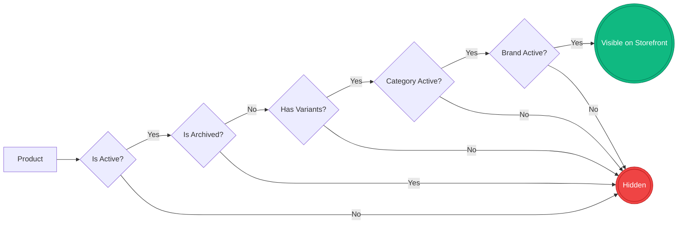
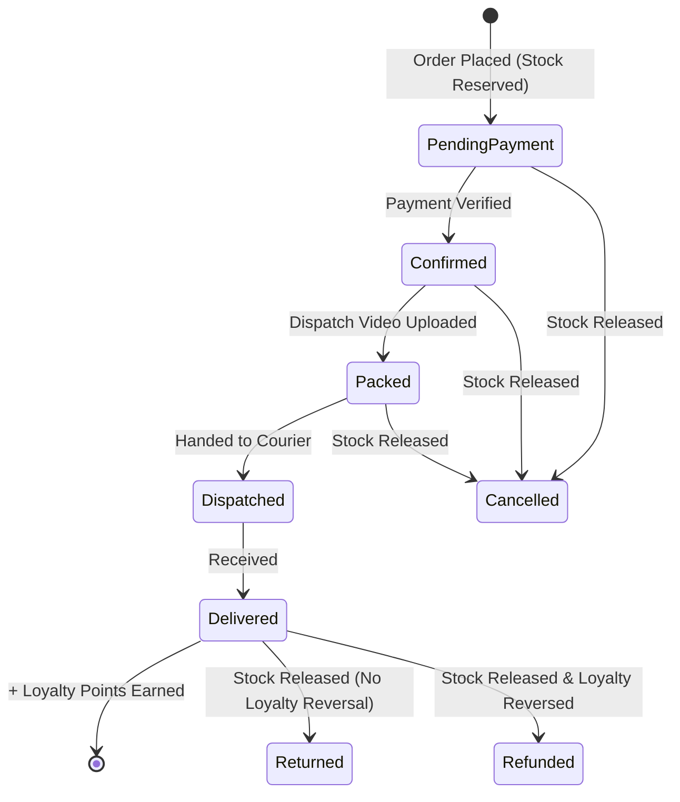
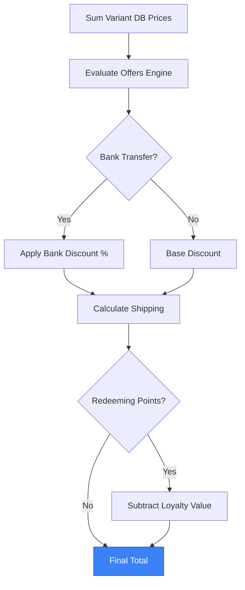
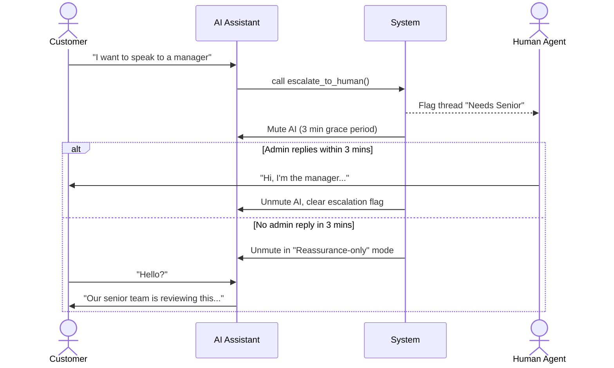
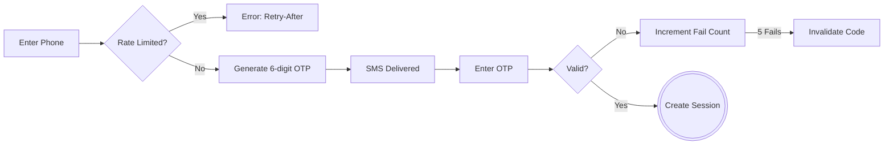

# Ibrahim Mobiles — Functional Specification

This document uses visual flows and dense tables to map the exact business rules, state machines, and conditionals of the platform.

---

## 1. Catalog Visibility & Domain Rules

### Visibility Cascade
A product must pass every gate in this flow to appear on the storefront. If any node fails, the product is completely hidden.

| Entity | Business Rules & Invariants |
|---|---|
| **Category** | **Integrity:** Cannot be deleted if referenced by products, brands, or grades. |
| **Brand** | **Scoping:** Brands are per-category (e.g., Apple in Phones vs Apple in Watches). |
| **Grade** | **Scoping:** Per-category condition tier (e.g., "Like New"). Drives badges and colors. |
| **Attribute** | **Visibility:** Can be set to show *Always*, *By Brand*, *By Grade*, or *By Parent Attribute* (cascading). |
| **Variant** | **Truth:** The absolute source of truth for price, stock, and condition.  **Stock:** In-stock if `quantity > 0`. |

---

## 2. Order Lifecycle & Fulfillment

### Status Timeline & Side Effects
This state machine dictates how an order progresses, when stock is released, and when loyalty points are awarded or reversed.

| Status | Allowed Actions & Side Effects |
|---|---|
| `pending-payment` | **Editable:** Line items, address, payment, delivery. Editing lines swaps stock reservations atomically. |
| `packed` | **Blocker:** Cannot enter this state without uploading/pasting a `dispatchVideoUrl`. |
| `dispatched` | **Invariant:** Cannot move status backward from here on the happy path. |

---

## 3. Checkout & Pricing Engine

### Price Calculation Flow
Prices are never trusted from the client. The server re-evaluates the cart at placement using this exact sequence.

| Feature | Rules & Conditionals |
|---|---|
| **Cart Limits** | Max 20 distinct lines. Max 10 qty per line (or variant stock cap). |
| **Offers Stacking** | Sequential based on admin `sortOrder`. First applied *non-stackable* offer stops evaluation. |
| **Delivery** | Courier is flat Rs 1,500 OR Free if subtotal ≥ admin threshold. Pickup is always free. |
| **Loyalty Redeem** | Min 100 points. Max 20% of subtotal. Disabled if an active offer explicitly disallows loyalty. |
| **Placement** | Idempotency key prevents double-charges. Insufficient stock throws an immediate error. |

---

## 4. AI Chat Assistant & Escalation

### Escalation Timeline
When the AI detects frustration or a direct request for a human, it triggers a strict escalation protocol.

| Feature | Rules & Conditionals |
|---|---|
| **Guest Limits** | Guests get 5 customer-authored messages max. Composer is then replaced by a sign-in gate. |
| **AI Auto-Reply** | Bubbles drip with human-paced typing delays (200-260 cpm). |
| **AI Tools** | Can search catalog, check stock, list deals, check user orders/loyalty (scoped strictly to session ID). |

---

## 5. Storefront Navigation & Filters

| Feature | Rules & Conditionals |
|---|---|
| **Search Overlay** | **< 2 chars:** Shows random hints + 5 recent searches. **≥ 2 chars:** Debounced live results. |
| **Filters (AND logic)** | All active filters sync to URL. Changing any filter resets infinite scroll to page 1. |
| **Dynamic Facets** | Attribute options load dynamically based on current filter set. Zero-count options are hidden. |
| **Infinite Scroll** | 24 items per page. Auto-loads ~600px before end. Furthest-loaded page replaces browser history. |
| **Configurator** | If exact variant combo doesn't exist, auto-selects closest stocked variant & shows WhatsApp inquiry button. |

---

## 6. Authentication & Admin Roles

### OTP Sign-In Flow

| Role | Capabilities & Limits |
|---|---|
| **Owner** | Full access. Only role with `order_delete` and `data_cleanup`. |
| **Business Mgr** | Catalog, Orders, Customers, Loyalty, Chat, Offers, Settings. *Blocked:* Team invites, hard deletes. |
| **Product Mgr** | Catalog CRUD and Media only. |
| **Marketing Mgr** | Offers, Categories, Brands, Media. Read-only products. |
| **Support Staff** | Read-only Catalog/Orders/Customers. Can view + reply to chats. |
