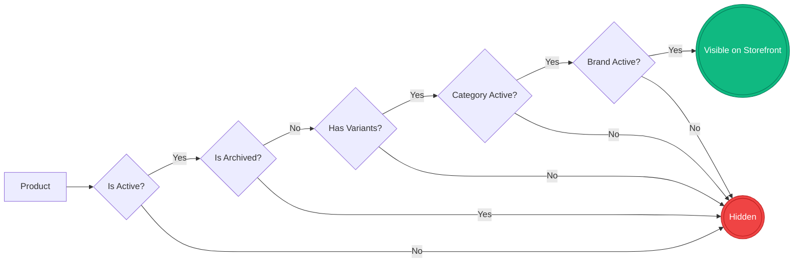
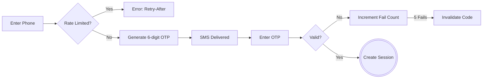
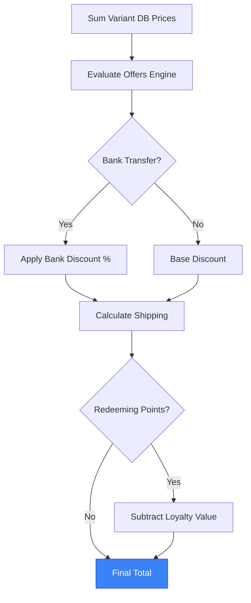
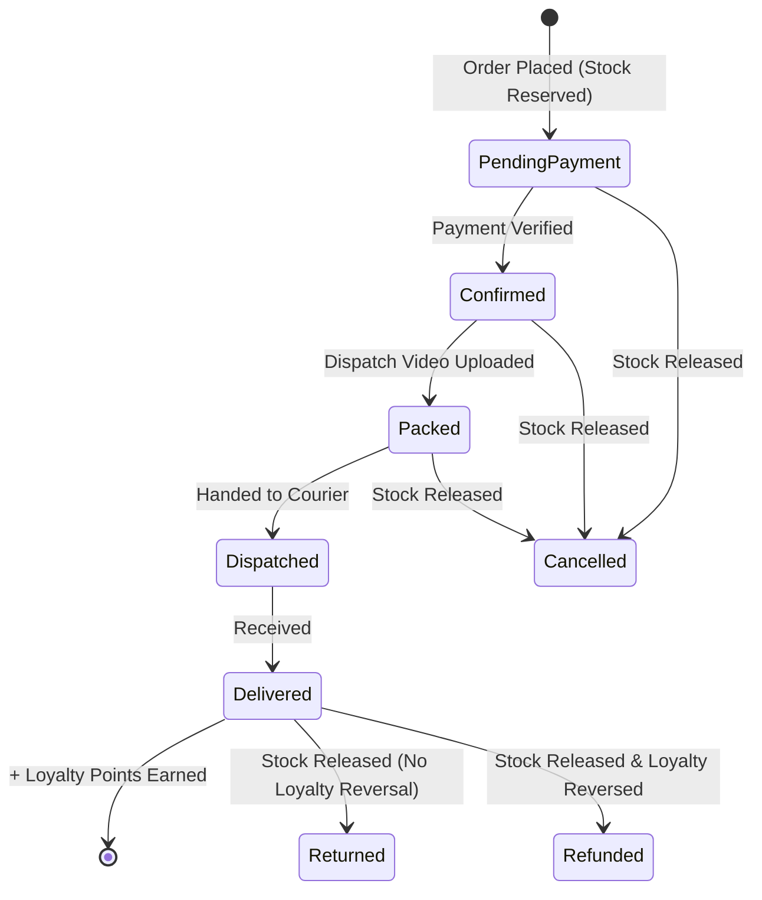
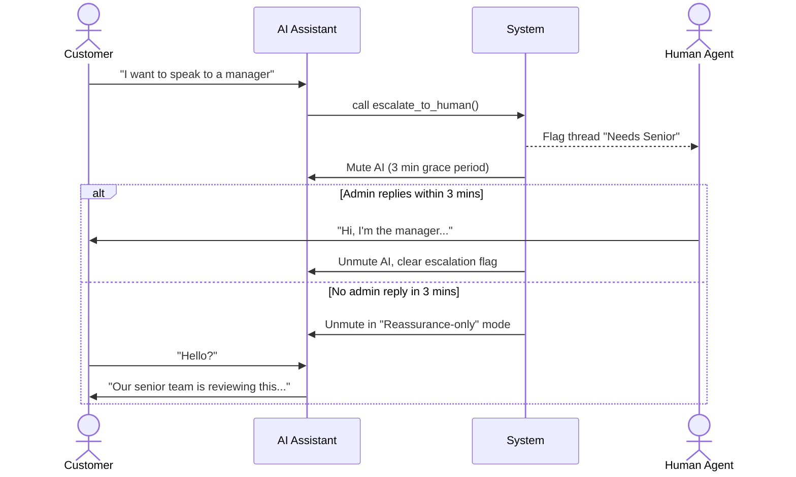

# Ibrahim Mobiles — Functional Specification

This document maps the exact business rules, state machines, and conditionals of the platform. It uses visual flows and dense tables to provide an exhaustive reference without lengthy paragraphs.

---

## 1. Catalog & Domain Rules

### Visibility Cascade
A product must pass every gate in this flow to appear on the storefront. If any node fails, the product is completely hidden.

### Core Entities
| Entity | Business Rules & Invariants |
|---|---|
| **Category** | • **Integrity:** Cannot be deleted if referenced by products, brands, or grades. • **Display:** Defines the vocabulary (grades, attributes) for its products. |
| **Brand** | • **Scoping:** Brands are per-category (e.g., Apple in Phones vs Apple in Watches). • **Integrity:** Cannot be deleted if products exist. |
| **Grade** | • **Scoping:** Per-category condition tier (e.g., "Like New"). • **Display:** Drives badges, colors, and optional inspection videos on the PDP. |
| **Attribute** | • **Scoping:** Per-category custom dimension (e.g., Storage, RAM, Color). • **Visibility Rules:** Can show *Always*, *By Brand*, *By Grade*, or *By Parent Attribute* (cascading). |
| **Product** | • **Media:** Up to 8 shared photos per product (variants share the gallery). • **Flags:** Active (on/off), Archived (soft delete), Featured (boosts in UI). |
| **Variant** | • **Truth:** The absolute source of truth for price, stock, and condition. • **Stock:** In-stock if `quantity > 0`. Reserved at checkout, released on cancel/refund/return. |

---

## 2. Storefront: Browsing & Discovery

### Global Shell & Home Page
| Feature | Rules & Conditionals |
|---|---|
| **Navigation** | • **Desktop:** Sticky top header. **Mobile:** Compact header + fixed bottom tab bar. • **Auth State:** "Account" vs "Sign in" label resolves client-side. |
| **Home Sections** | • **Hero:** Pill with active categories, trending products, "Visit store" CTA. • **Categories:** Featured cards. Inactive categories show "Soon" and are unclickable. • **Process:** 3 flows (Store, Order, Return). Uses admin-configured money-back days. • **Grades:** Dark band with per-grade cards and videos. • **Footer:** Maps, hours, delivery blurb, accepted payments. |
| **Notice Banner** | • Shown only if enabled in Admin with text. Dismissible for the session. |

### Search, Filters & Listing
| Feature | Rules & Conditionals |
|---|---|
| **Search Overlay** | • **< 2 chars:** Shows random hints + 5 recent browser searches. • **≥ 2 chars:** Debounced live results (max 10) with variant counts. • **Submit:** Routes to `/shop?q=...` and saves to recent searches. Max 100 chars. |
| **Filters (AND)** | • **Sync:** All active filters sync to URL query params. • **Dynamic Facets:** Attribute options load dynamically based on current filter set. • **Hiding:** Zero-count brand/grade options are hidden unless currently selected. • **Price:** Min/Max requires explicit "Apply" click. |
| **Infinite Scroll** | • **Batch:** 24 items per page. • **Trigger:** Auto-loads ~600px before end, or via "Load more" fallback. • **Reset:** Changing any filter resets infinite scroll to page 1. |
| **Deals Page** | • **Offers:** Streams in active offers. Hidden if none exist. • **Sale Grid:** Shows admin-flagged "Featured" products. |

### Product Detail Page (PDP)
| Element | Rules & Conditionals |
|---|---|
| **URL Sync** | • Variant selections sync to URL params. Invalid combos silently reset to defaults. |
| **Configurator** | • **Incomplete:** Price hidden, missing attributes highlighted. • **Complete:** Price, stock, quantity stepper, and "Add to cart" appear. • **Closest Match:** If exact combo doesn't exist, auto-selects closest stocked variant and shows a pre-filled WhatsApp inquiry button. |
| **Stock & Qty** | • **Max Qty:** Variant stock minus current cart quantity. • **Shortcut:** "Buy all (N)" appears if stock > 1 and qty < max. • **Sold Out:** Button disabled. Mobile sticky bar drops WhatsApp button. |
| **Showcase** | • **Grade Panel:** Updates with selected variant's grade (notes, warranty, video). • **Related:** Same category + brand, excluding current product. |

---

## 3. Storefront: Cart, Checkout & Auth

### OTP Sign-In Flow

### Cart & Account
| Feature | Rules & Conditionals |
|---|---|
| **Cart Limits** | • **Max Lines:** 20 distinct product+variant pairs. • **Max Qty:** 10 per line (or variant stock, whichever is lower). • **Persistence:** LocalStorage, syncs across tabs, survives refresh. |
| **OTP Auth** | • **Identity:** Phone number (normalized to last 10 digits). No passwords. • **Limits:** Max 5 issues / 15 min. Resend cooldown 30s. • **Fallback:** If SMS provider fails (5xx), UI offers manual admin code entry. |
| **Profile** | • Phone is immutable. Name and City required to save. • Addresses: Max 6. Cannot delete the last remaining address. |

### Checkout Steps & Success
| Step | Rules & Conditionals |
|---|---|
| **0. Auth Gate** | • **Guest:** Blocked. Shows read-only summary and sign-in panel. • **Signed-in:** Allowed to proceed. |
| **1. Delivery** | • **Pickup:** Free. • **Courier:** Flat Rs 1,500 OR Free if subtotal ≥ admin threshold. Address required. |
| **2. Payment** | • Options: Bank Transfer, Easypaisa, JazzCash, COD (toggled in admin). • **Discount:** Bank Transfer automatically applies admin-configured % discount. |
| **3. Loyalty** | • **Min Redeem:** 100 points. **Max Redeem:** 20% of order subtotal. • **Blocker:** Disabled if an active offer explicitly disallows loyalty redemption. • **Input:** Toggle applies max available automatically (no partial manual entry). |
| **4. Placement** | • **Validation:** Name > 1 char, Phone ≥ 7 chars, Address valid, Policy checked. • **Security:** Idempotency key prevents double-charges. • **Server Truth:** Prices re-fetched from DB. Client prices ignored. • **Stock:** Reserved atomically at placement. Insufficient stock throws error. |
| **5. Success** | • Shows order number, timeline, payment instructions (if total > 0), and loyalty summary. |

---

## 4. Pricing, Offers & Loyalty

### Price Calculation Flow
Prices are never trusted from the client. The server re-evaluates the cart at placement using this exact sequence.

### Offers & Loyalty Rules
| System | Rules & Conditionals |
|---|---|
| **Offers Engine** | • **Evaluation:** Sequential based on admin `sortOrder`. • **Stacking:** First applied *non-stackable* offer stops evaluation. • **Conditions:** Product, Category, Brand, Grade, Attribute, Price Range, Cart Total. • **Actions:** % off, Fixed Rs off, Free Shipping. Target: Matched items or Cart. |
| **Loyalty Earn** | • **Rate:** Configurable % of subtotal (e.g., 1%). • **Trigger:** Points credited ONLY when order status → `delivered`. • **Reversal:** Points reversed if a `delivered` order changes to `cancelled` or `refunded`. |
| **Loyalty Value** | • 1 Point = Rs 1. |

---

## 5. Order Lifecycle & Fulfillment

### Status Timeline & Side Effects
This state machine dictates how an order progresses, when stock is released, and when loyalty points are awarded or reversed.

### Order Statuses & Admin Actions
| Status | Allowed Actions & Side Effects |
|---|---|
| `pending-payment` | **Editable:** Line items, address, payment, delivery. Editing lines swaps stock reservations atomically. |
| `confirmed` | **Lock:** Order locked (read-only). Payment acknowledged. |
| `packed` | **Blocker:** Cannot enter this state without uploading/pasting a `dispatchVideoUrl`. |
| `dispatched` | **Invariant:** Cannot move status backward from here on the happy path. |
| `delivered` | **Side Effect:** Credits `pointsEarned` to customer loyalty balance. |
| `cancelled` / `refunded` | **Side Effect:** Releases reserved stock. Reverses loyalty points *if* previously delivered. |
| `returned` | **Side Effect:** Releases reserved stock. (Does *not* reverse loyalty). |

---

## 6. Chat & AI Assistant

### Escalation Timeline
When the AI detects frustration or a direct request for a human, it triggers a strict escalation protocol.

### Chat Rules & Capabilities
| Feature | Rules & Conditionals |
|---|---|
| **Guest Limits** | • Guests get 5 customer-authored messages max. Composer is then replaced by a sign-in gate. • Threads merge to customer account upon sign-in. |
| **AI Auto-Reply** | • Triggers after customer messages if enabled and not in escalation grace period. • **Pacing:** Bubbles drip with human-paced typing delays (200-260 cpm). |
| **AI Tools** | • Can search catalog, check stock, list deals, check user orders/loyalty (scoped strictly to session ID). |

---

## 7. Admin Console: Workspaces

### Customers & Inquiries
| Workspace | Rules & Conditionals |
|---|---|
| **Customers** | • **Segments:** All, Loyalty, With Orders. • **Counts:** Total loyalty balance streams in progressively. • **Delete:** Blocked if `orderCount > 0`. • **Manual OTP:** Admins can generate a 15-min sign-in code for users failing to get SMS. |
| **Inquiries** | • **Filters:** Anonymous threads are excluded from the default view. • **Read State:** Opening a thread zeros `unreadByTeam`. Replying increments `unreadByCustomer`. • **Assignment:** Replying to an unassigned thread auto-assigns it to the operator. |

### Products, Categories & Brands
| Workspace | Rules & Conditionals |
|---|---|
| **Products** | • **Delete:** Blocked if referenced by orders. Use `isActive` toggle instead. • **Variants:** Duplicate attribute combinations are rejected by the server. • **Wizard:** Step 1 (Details & Photos) -> Step 2 (Variants by Grade). |
| **Categories** | • **Management:** Create/edit label, slug, icon, sort order, structured marketing content, SEO. |
| **Brands** | • **Management:** Scoped to a category. Used in product wizard brand picker. |

---

## 8. Admin Console: System & Security

### Roles & Permissions
*Super-admin flag bypasses all role matrices and grants all keys.*

| Role | Capabilities & Limits |
|---|---|
| **Owner** | Full access. Only role with `order_delete` and `data_cleanup`. |
| **Business Mgr** | Catalog, Orders, Customers, Loyalty, Chat, Offers, Settings. *Blocked:* Team invites, hard deletes. |
| **Product Mgr** | Catalog CRUD and Media only. |
| **Marketing Mgr** | Offers, Categories, Brands, Media. Read-only products. |
| **Support Staff** | Read-only Catalog/Orders/Customers. Can view + reply to chats. |

### Settings & Activity Log
| Feature | Rules & Conditionals |
|---|---|
| **Settings** | • **Live Updates:** Changes to branding, policies, payments, and chat config apply to the storefront immediately. • **Data Cleanup:** Owner-only tool to bulk-delete catalog, orders, customers, or inquiries. |
| **Activity Log** | • Append-only audit trail of all mutations (actor, action, resource, timestamp). Failures to log do not block business operations. |