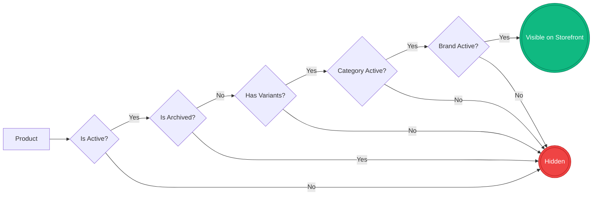
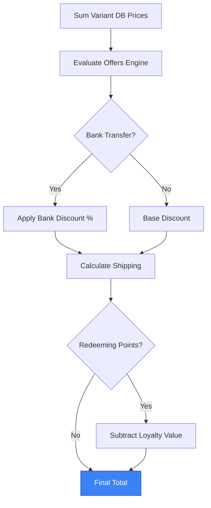
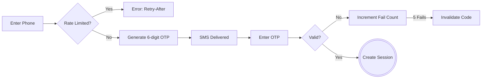
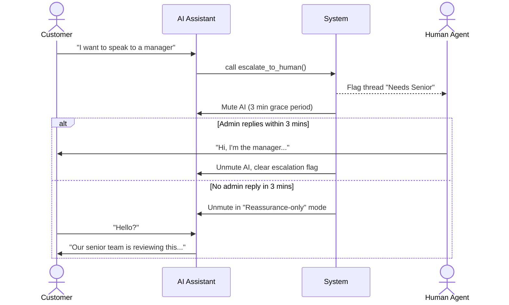
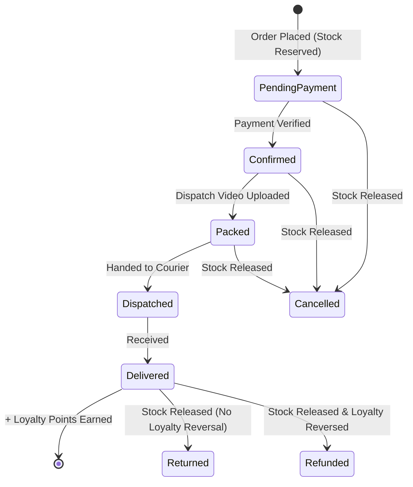

# Ibrahim Mobiles

This document maps the exact business rules, state machines, limits, and conditionals of the platform. It uses visual flows, dense tables, and structured lists to provide maximum detail without lengthy paragraphs.

---

## 1. Catalog & Domain Rules

### Visibility Cascade
A product must pass every gate in this flow to appear on the storefront. If any node fails, the product is completely hidden.

### Core Entities & Invariants

*   **Category**
    *   **Identity:** URL slug (auto-generated from label if absent).
    *   **Content:** Description blurb, icon, sort order, optional rich marketing content (summary + icon-tagged bullets), optional SEO overrides.
    *   **Integrity:** Cannot be deleted if referenced by products, brands, or grades. Deactivate instead.
    *   **Rule:** Inactive categories hide all descendant products from every shopper surface.
*   **Brand**
    *   **Scoping:** Brands are per-category (e.g., Apple in Phones vs Apple in Watches).
    *   **Integrity:** Cannot be deleted if products exist. Deactivate instead.
    *   **Rule:** Admin product form only shows brands whose `categorySlugs` includes the chosen category.
*   **Grade (Condition)**
    *   **Scoping:** Per-category condition tier (e.g., "Like New", "Refurbished").
    *   **Display:** Drives badges, hex colors, notes, and optional inspection videos on the PDP.
*   **Attribute (Custom Dimension)**
    *   **Scoping:** Per-category custom dimension (e.g., Storage, RAM, Color).
    *   **Visibility Rules:** Can show *Always*, *By Brand*, *By Grade*, or *By Parent Attribute* (cascading).
    *   **Card Position:** Renders on product cards as image overlay, title chips, or hidden.
    *   **Rule:** Cascading attributes clear dependent child filters when the parent changes.
*   **Product**
    *   **Media:** Up to 8 shared photos per product (variants share the gallery). Index 0 is the hero image.
    *   **Flags:** Active (master on/off), Archived (soft delete, hides from default admin views), Featured (boosts in UI rails and deals page).
*   **Variant**
    *   **Truth:** The absolute source of truth for price, stock, warranty days, and condition.
    *   **Stock:** In-stock if `quantity > 0`. Reserved atomically at checkout, released on cancel/refund/return.

---

## 2. Storefront: Global Shell & Home Page

### Global Layout & Navigation
*   **Desktop:** Sticky top header with full navigation. Cart opens as a dropdown popover.
*   **Mobile:** Compact top header + fixed bottom tab bar (Home, Shop, Deals, Cart, Account). Extra bottom padding ensures content clears the tab bar. Cart tab opens full page.
*   **Auth State:** "Account" vs "Sign in" label resolves client-side.
*   **Notice Banner:** Shown only if enabled in Admin with text. Dismissible for the session.
*   **404 Page:** Shows message + links to home and shop browse.

### Home Page Sections (Streamed in with Skeletons)
*   **Hero:** Pill with active categories (or "Shop every category"), animated headline, trending products, "Visit store" CTA. On mobile, fills viewport minus header/tab bar.
*   **Browse by Category:** Featured cards. *Conditional:* Inactive categories show "Soon" and are unclickable. *Conditional:* If more categories exist than the cap, shows "Browse all".
*   **Process:** 3 flows (Store, Order, Return). Uses admin-configured money-back days and bank-transfer discount %.
*   **Grades (Dark Band):** Headline + category tabs. Per-grade cards with badge, notes, video. *Conditional:* If data fails, copy shows but grid is empty.
*   **Visit Store:** Address, hours, embedded map, Maps link, accepted payments, delivery blurb. *Layout:* Mobile puts map above details; Desktop is side-by-side.

---

## 3. Storefront: Shop, Search & Filters

### Search Overlay
*   **Trigger:** Opens full-screen from header. Body scroll locks. Input auto-focuses.
*   **< 2 chars:** Shows randomized hint chips + up to 5 recent browser searches.
*   **≥ 2 chars:** Debounced live results (max 10) with variant counts and loading skeletons.
*   **Submit:** Routes to `/shop?q=...`, saves to recent searches, closes overlay. Max 100 chars.
*   **Empty State:** "No results" with option to search all.

### Shop & Category Listings
*   **Routing:** `/shop` redirects to first active category. `/shop?q=...` renders global search. `/shop/{category}` renders listing.
*   **Conditionals:** Unknown category = 404. Inactive category = "Coming soon" page without grid.
*   **Layout:** Desktop has sticky left filter sidebar + category rail. Mobile has category picker dropdown + "Filters" bottom sheet.
*   **Category Rail:** *Conditional:* Inactive categories appear disabled ("Soon"). Switching categories does not preserve filters.

### Filters (AND Logic) & Infinite Scroll
*   **Sync:** All active filters (brand, grade, min/max price, attributes, sort, q) sync to URL query params.
*   **Price:** Min/Max requires explicit "Apply" click (no auto-apply on blur).
*   **Dynamic Facets:** Attribute options load dynamically based on current filter set. *Conditional:* Zero-count brand/grade options are hidden unless currently selected.
*   **Infinite Scroll:** 24 items per page. Auto-loads ~600px before end, or via "Load more" fallback. Furthest-loaded page replaces browser history.
*   **Reset:** Changing any filter resets infinite scroll to page 1.
*   **Empty States:** *Conditional:* Filters active, no matches = "No more products match your selection". *Conditional:* No filters, no stock = "No {category} in stock right now".

### Product Cards & Deals Page
*   **Product Cards:** Show brand, name, hero image, grade badge, attribute chips. *Conditional:* Multiple grades = cycles grade slides on hover. *Conditional:* Out of stock = "Sold out" overlay. *Conditional:* Active offer = Offer title badge.
*   **Deals Page:** Static hero. *Conditional:* Active offers stream in (hidden if none). Sale Grid shows admin-flagged "Featured" products.

---

## 4. Storefront: Product Detail Page (PDP)

### Layout & Routing
*   **URL Sync:** Variant selections sync to URL params. *Conditional:* Invalid combos silently reset to defaults. Legacy `?variant=id` auto-redirects to readable attribute params.
*   **Layout:** Desktop = Breadcrumbs + 2-column (gallery | configurator) + grade showcase + related rail. Mobile = Gallery card + configurator + grade showcase + related rail + sticky bottom purchase bar.
*   **Gallery:** Hero image, thumbnails, lightbox zoom. Mobile supports swipe/cross-fade. Images follow selected variant if variant-specific images exist.

### Configurator & Actions
*   **Incomplete Selection:** Price hidden, missing attributes highlighted.
*   **Complete Selection:** Price, stock, quantity stepper, and "Add to cart" appear.
*   **Closest Match:** *Conditional:* If exact combo doesn't exist, auto-selects closest stocked variant and shows a pre-filled WhatsApp inquiry button.
*   **Stock & Qty:** Max qty is variant stock minus current cart qty. *Conditional:* "Buy all (N)" shortcut appears if stock > 1 and qty < max. *Conditional:* Sold Out = Button disabled, mobile sticky bar drops WhatsApp button.
*   **Pricing:** Evaluates active offers client-side. Shows strikethrough, discounted price, and offer badge if applicable.
*   **Grade Showcase:** Updates with selected variant's grade (notes, warranty, video). *Conditional:* Omitted if grade data missing.
*   **Related Products:** Same category + brand. *Conditional:* "No more products" if none.

---

## 5. Storefront: Cart & Checkout

### Price Calculation Flow
Prices are never trusted from the client. The server re-evaluates the cart at placement using this exact sequence.

### Cart Behavior
*   **Limits:** Max 20 distinct product+variant pairs. Max 10 qty per line (or variant stock cap).
*   **Persistence:** LocalStorage, syncs across tabs, survives refresh. Hydration gate prevents empty flash.
*   **Layout:** Desktop dropdown shows summary + line items. Full page `/cart` has mobile scrollable list vs desktop sidebar.

### Checkout Steps & Validation
| Step | Rules & Conditionals |
|---|---|
| **0. Auth Gate** | • **Guest:** Blocked. Shows read-only summary and sign-in panel. • **Signed-in:** Allowed to proceed. |
| **1. Contact** | • Name (editable, min 2 chars). Phone (read-only from verified account). |
| **2. Delivery** | • **Pickup:** Free. Shows store hours. • **Courier:** Flat Rs 1,500 OR Free if subtotal ≥ admin threshold. Address required (min 2 chars). Pre-fills default saved address. |
| **3. Payment** | • Options: Bank Transfer, Easypaisa, JazzCash, COD. • **Discount:** Bank Transfer automatically applies admin-configured % discount. |
| **4. Loyalty** | • **Min Redeem:** 100 points. **Max Redeem:** 20% of order subtotal. • **Blocker:** Disabled if an active offer explicitly disallows loyalty redemption. • **Input:** Toggle applies max available automatically (no partial manual entry). |
| **5. Placement** | • **Validation:** Name > 1 char, Phone ≥ 7 chars, Address valid, Policy checked. • **Security:** Idempotency key prevents double-charges. Max 5 placements / 15 min. • **Server Truth:** Prices re-fetched from DB. Client prices ignored. • **Stock:** Reserved atomically at placement. Insufficient stock throws error. |

### Checkout Success
*   **Display:** Order number, timeline, payment instructions (if total > 0), and loyalty summary.
*   **Guards:** Requires valid session and `order` query param.

---

## 6. Storefront: Auth & Account

### OTP Sign-In Flow

### Account Rules
*   **Identity:** Phone number (normalized to last 10 digits). No passwords.
*   **OTP Limits:** Max 5 issues / 15 min. Resend cooldown 30s. Max 5 wrong guesses per code.
*   **OTP Fallback:** If SMS provider fails (5xx), UI offers manual admin code entry ("I have a code from our team").
*   **Session:** 30-day persistent HTTP-only cookie. Claims any anonymous chat threads matching the phone on creation.
*   **Profile:** Phone is immutable. Name and City required to save. Addresses: Max 6. Cannot delete the last remaining address.
*   **Dashboard:** Shows active orders, total spent, order history filters. Loyalty sidebar shows balance and pending points.
*   **Sign-out:** Clears session, anonymous chat cookies, local cart, and client signed-in flag.

---

## 7. Chat & AI Assistant

### Escalation Timeline
When the AI detects frustration or a direct request for a human, it triggers a strict escalation protocol.

### Chat Rules & Capabilities
*   **Guest Limits:** Guests get 5 customer-authored messages max. Composer is then replaced by a sign-in gate. Threads merge to customer account upon sign-in.
*   **AI Auto-Reply:** Triggers after customer messages if enabled and not in escalation grace period.
*   **Pacing:** Bubbles drip with realistic human-paced delays. Includes message-length-based reading time (with simulated "busy" agent delays) followed by typing time (220-300 cpm). Typing indicator only shows during the actual typing phase.
*   **Initial Connection:** Displays "Connecting you with someone..." instead of a typing indicator while the thread is being created.
*   **AI Tools:** Can search catalog, check stock, list deals, check user orders/loyalty (scoped strictly to session ID). Product context is automatically passed if chat is opened from a PDP.
*   **UI States:** Unread badge on launcher. Proactive nudge after idle minutes. Reconnecting subtitle. "Speak to someone" footer hint.
*   **Polling:** 5s when tab focused / 30s when blurred. 120/min/IP limit.

---

## 8. Loyalty & Offers Engine

### Offers Engine
*   **Evaluation:** Sequential based on admin `sortOrder`.
*   **Stacking:** First applied *non-stackable* offer stops evaluation.
*   **Conditions:** Product, Category, Brand, Grade, Attribute, Price Range, Cart Total. Operators: in, not_in, between, gte, lte.
*   **Actions:** % off, Fixed Rs off, Free Shipping. Target: Matched items or Cart.
*   **Constraints:** Schedule window, usage limit, allow loyalty points flag.

### Loyalty Rules
*   **Earn Rate:** Configurable % of subtotal (e.g., 1%). Earned on subtotal *before* payment discounts.
*   **Trigger:** Points credited ONLY when order status → `delivered`.
*   **Reversal:** Points reversed if a `delivered` order changes to `cancelled` or `refunded`. (Returns do *not* reverse loyalty).
*   **Value:** 1 Point = Rs 1.
*   **Bonuses:** Review and Referral bonuses exist in copy but are awarded via manual admin adjustment.

---

## 9. Order Lifecycle & Fulfillment

### Status Timeline & Side Effects
This state machine dictates how an order progresses, when stock is released, and when loyalty points are awarded or reversed.

### Order Statuses & Admin Actions
| Status | Allowed Actions & Side Effects |
|---|---|
| `pending-payment` | **Editable:** Line items, address, payment, delivery. Editing lines swaps stock reservations atomically. |
| `confirmed` | **Lock:** Order locked (read-only). Payment acknowledged. |
| `packed` | **Blocker:** Cannot enter this state without uploading/pasting a `dispatchVideoUrl`. |
| `dispatched` | **Invariant:** Cannot move status backward from here on the happy path. |
| `delivered` | **Side Effect:** Credits `pointsEarned` to customer loyalty balance. |
| `cancelled` / `refunded` | **Side Effect:** Releases reserved stock. Reverses loyalty points *if* previously delivered. |
| `returned` | **Side Effect:** Releases reserved stock. (Does *not* reverse loyalty). |

---

## 10. Admin Console: Workspaces & Flows

### Global Admin Patterns
*   **Session:** Distinct cookie from storefront. Drops on browser close, 30-day JWT ceiling. Missing permissions redirect to dashboard with toast.
*   **Layout:** List + detail split on desktop; mobile shows list OR detail.
*   **Infinite Scroll:** Orders, customers, inquiries load more pages on scroll.
*   **Deferred Counts:** Heavy aggregates (total revenue, segment counts) stream in after first paint with shimmer skeletons.
*   **Search:** Debounced text search syncs to the URL and refetches the list.

### Orders Workspace
*   **Filters:** Status tabs. Search by order number, name, phone, city.
*   **Stepper:** Clickable forward steps. Can only step backward if < dispatched.
*   **Actions:** Print invoice, WhatsApp customer (normalizes phone), Cancel order (runs cancel side-effects). Hard delete requires `order_delete` permission.

### Customers Workspace
*   **Segments:** All, Loyalty, With Orders.
*   **Create:** Phone normalized. Duplicate phone conflicts rejected.
*   **Details:** Profile (phone is read-only), Addresses, Orders, Loyalty transactions, Inquiries.
*   **Actions:** Generate 15-min manual sign-in code. Adjust loyalty balance (requires reason, cannot drive below zero). Delete blocked if `orderCount > 0`.

### Inquiries Inbox
*   **Filters:** Anonymous threads are excluded from the default view.
*   **Read State:** Opening a thread zeros `unreadByTeam`. Replying increments `unreadByCustomer`.
*   **Assignment:** Replying to an unassigned thread auto-assigns it to the operator.
*   **Actions:** Change status (Open, Awaiting Customer, Resolved), add internal notes, attach files (JPEG, PNG, WebP, PDF, plain text).

### Catalog (Products, Categories, Brands)
*   **Products:** Delete blocked if referenced by orders. Use `isActive` toggle instead. Wizard Step 1 (Details & Photos) -> Step 2 (Variants by Grade). Duplicate attribute combinations are rejected.
*   **Categories:** Create/edit label, slug, icon, sort order, structured marketing content, SEO.
*   **Brands:** Scoped to a category. Used in product wizard brand picker.

---

## 11. Admin Console: System & Security

### Admin Authentication
*   **Limits:** 8 attempts / 15 min per IP+email.
*   **Security:** Generic failure message (no hint whether email exists). Reset password token hashed, 1-hour expiry.
*   **Passwords:** 8–128 chars, at least one letter and one digit.

### Roles & Permissions
*Super-admin flag bypasses all role matrices and grants all keys.*

| Role | Capabilities & Limits |
|---|---|
| **Owner** | Full access. Only role with `order_delete` and `data_cleanup`. |
| **Business Mgr** | Catalog, Orders, Customers, Loyalty, Chat, Offers, Settings. *Blocked:* Team invites, hard deletes, data cleanup. |
| **Product Mgr** | Catalog CRUD and Media only. |
| **Marketing Mgr** | Offers, Categories, Brands, Media. Read-only products. |
| **Support Staff** | Read-only Catalog/Orders/Customers. Can view + reply to chats. |

### Settings & Activity Log
*   **Settings Tabs:** Store details, Contact, Payments, Delivery, Notices, Loyalty, Policies, Inventory, SEO, Chat widget, Integrations, Data cleanup.
*   **Live Updates:** Changes to branding, policies, payments, and chat config apply to the storefront immediately.
*   **Data Cleanup:** Owner-only tool to bulk-delete catalog, orders, customers, or inquiries.
*   **Activity Log:** Append-only audit trail of all mutations (actor, action, resource, timestamp). Failures to log do not block business operations. Filters by resource type and action. Tracks: created, updated, deleted, archived, restored, status_changed, login, logout, invited, signin_code_issued.
*   **Shop Health:** Dashboard card checks for missing site name, missing support contacts, invalid pixels, products without images, and out-of-stock variants.