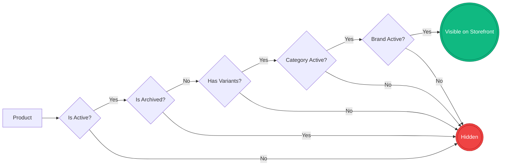
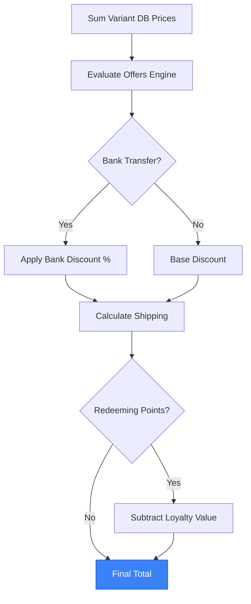
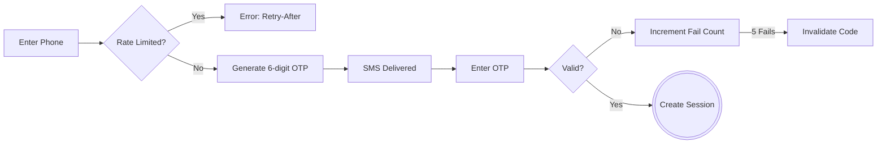
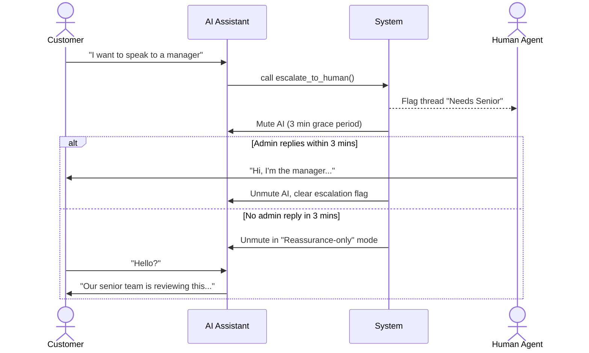
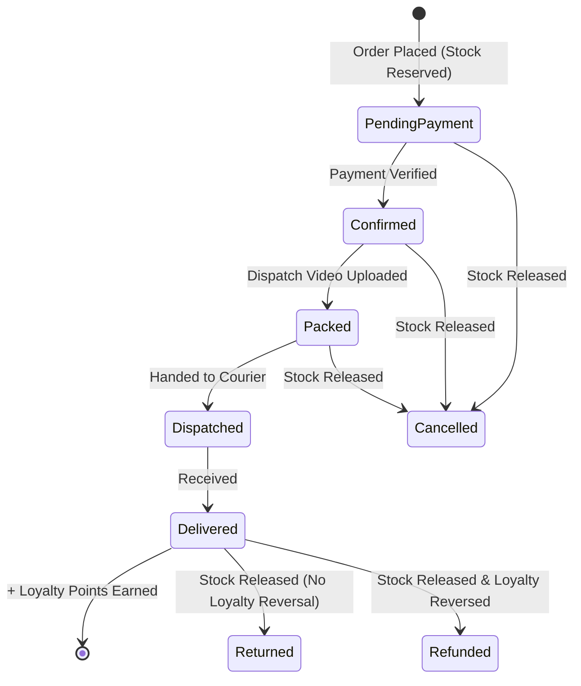

# Ibrahim Mobiles

This document maps the exact business rules, state machines, limits, and conditionals of the platform. It uses visual flows, dense tables, and structured lists to provide maximum detail without lengthy paragraphs.

---

## Documentation

Operational and technical docs live in `docs/`:

- [Setup & Onboarding](docs/setup.md) — install, env vars, local dev, troubleshooting
- [Architecture](docs/architecture.md) — monorepo layout, apps, packages, MongoDB collections, boundaries
- [Catalog operations](docs/catalog.md) — how products, attributes, pools, and variants work in Admin

---

## 1. Catalog & Domain Rules

### Data source

- **MongoDB is the catalog source of truth.** Categories, grades, attributes, brands, products, and variants are created and edited in the Admin console.
- **No repo seed scripts.** There is no JSON import path or one-time migration folder in this repository — catalog changes are normal admin CRUD.
- **Orders are snapshots.** At checkout each line stores `productName`, `variantSummary`, and `unitPriceRupees`. Changing catalog data does not rewrite past orders. Replacing all variants on a product assigns new `variantId` values — open carts and in-flight checkouts for that product must be refreshed.

### Attribute model (three layers)

| Layer | Where | Purpose |
| ----- | ----- | ------- |
| **Category attribute** | `attributes` collection | Global dimension per category (e.g. Storage, Color, PTA status) with shared `options[]` used as templates for filters and labels. |
| **Product config** | `products.attributeSlugs`, `attributeOptionPool`, `attributeCustomOptions`, optional `attributeDefaults` | Which dimensions this product uses; which global option **values** are allowed; product-only values with display labels (e.g. iPhone-specific colors). |
| **Variant row** | `products.variants[]` | One sellable SKU: `gradeSlug`, `priceRupees`, `quantity`, `forceOutOfStock`, optional `warrantyDays`, and chosen attribute values. |

**Rule:** A variant value must exist in the product pool — either a whitelisted global option value or a `attributeCustomOptions` entry. Duplicate attribute combinations within the same grade are rejected in Admin.

### Visibility Cascade

A product must pass every gate in this flow to appear on the storefront. If any node fails, the product is completely hidden.

### Core Entities & Invariants

- **Category**
  - **Identity:** URL slug (auto-generated from label if absent).
  - **Content:** Description blurb, icon, sort order, optional rich marketing content (summary + icon-tagged bullets), optional SEO overrides.
  - **Integrity:** Cannot be deleted if referenced by products, brands, or grades. Deactivate instead.
  - **Rule:** Inactive categories hide all descendant products from every shopper surface.
- **Brand**
  - **Scoping:** Brands are per-category (e.g., Apple in Phones vs Apple in Watches).
  - **Integrity:** Cannot be deleted if products exist. Deactivate instead.
  - **Rule:** Admin product form only shows brands whose `categorySlugs` includes the chosen category.
- **Grade (Condition)**
  - **Scoping:** Per-category condition tier (e.g., "Like New", "Refurbished").
  - **Display:** Drives badges, hex colors, notes, and optional inspection videos on the PDP.
- **Attribute (Custom Dimension)**
  - **Scoping:** Per-category custom dimension (e.g., Storage, RAM, Color).
  - **Visibility Rules:** Shop filters may show _Always_, _By Brand_, or _By Grade_. Which attributes appear on a product's variants is configured per product on the product details page (`attributeSlugs`).
  - **Card Position:** Renders on product cards as image overlay, title chips, or hidden.
- **Product**
  - **Media:** Up to 8 photos on the product document only — every variant shares the same gallery. Index `0` is the hero image. There are no per-variant or per-grade images.
  - **Flags:** `isActive` (master on/off), `isArchived` (soft delete; hidden from default admin lists), `isFeatured` (Deals page and offer rails).
  - **Attribute setup (admin Step 2):** Pick `attributeSlugs`, tune `attributeOptionPool` per slug, add `attributeCustomOptions` for model-specific values, optional `attributeDefaults` for new variant drafts. See [Catalog operations](docs/catalog.md).
- **Variant**
  - **Truth:** Source of truth for price (`priceRupees`), stock (`quantity`), condition (`gradeSlug`), warranty (`warrantyDays`), and attribute combination.
  - **Attributes:** `attributes` map — one string per slug, or string array when multiple global values apply on one row (e.g. three colors). `attributeDisplay` supplies labels for custom pool values.
  - **Stock:** In stock when `quantity > 0` and `forceOutOfStock` is false. Reserved atomically at order placement; released on cancel, refund, or return.
  - **Force sold out:** `forceOutOfStock` hides the variant on the storefront without changing `quantity`.

---

## 2. Storefront: Global Shell & Home Page

### Global Layout & Navigation

- **Desktop:** Sticky top header — Home, Deals, About, Account, Search, Cart. No separate Shop link; the catalog lives on Home.
- **Mobile:** Compact top header + fixed bottom tab bar (Home, Deals, Support, Cart, Account). **Support** opens live chat (highlighted while open; no header close on mobile — switch tabs to dismiss). WhatsApp when chat is off or on checkout/sign-in. About remains in the desktop header only.
- **Auth State:** "Account" vs "Sign in" label resolves client-side.
- **Notice Banner:** Shown only if enabled in Admin with text. Dismissible for the session.
- **404 Page:** Shows message + links to home browse.

### Home Page (`/`)

- **Purpose:** Catalog entry — search only. With no `?q=` param, redirects to the first active category (`/{categorySlug}`).
- **Search:** `/?q=…` renders global search results (hero + product grid). Search overlay submit uses the same URL.
- **About Page (`/about`):** Full marketing homepage — hero, browse-by-category tiles, process, grades, and visit-store sections. Category tiles link to `/{categorySlug}`.

### About Page (former homepage content)

- **Hero:** Full-viewport hero with mask-sweep headline, trending product name band, and **Visit store** CTA → `/`.
- **Browse by category:** Featured category cards. Active cards link to `/{categorySlug}`; inactive show **Soon**.
- **Process:** 3 flows (Store, Order, Return). Uses admin-configured money-back days and bank-transfer discount %.
- **Grades (Dark Band):** Headline + category tabs. Per-grade cards with badge, notes, video. _Conditional:_ If data fails, copy shows but grid is empty.
- **Visit Store:** Address, hours, embedded map, Maps link, accepted payments, delivery blurb. _Layout:_ Mobile puts map above details; Desktop is side-by-side.

---

## 3. Storefront: Shop, Search & Filters

### Search Overlay

- **Trigger:** Opens full-screen from header. Body scroll locks. Input auto-focuses.
- **< 2 chars:** Shows randomized hint chips + up to 5 recent browser searches.
- **≥ 2 chars:** Debounced live results (max 10) with variant counts and loading skeletons.
- **Submit:** Routes to `/?q=…`, saves to recent searches, closes overlay. Max 100 chars.
- **Empty State:** "No results" with option to search all.

### Shop & Category Listings

- **Routing:** Category listings live at `/{categorySlug}` with filter query params on the same URL. Product detail URLs are `/{categorySlug}/{productSlug}`. Reserved segments (`/about`, `/cart`, etc.) are not categories.
- **Conditionals:** Unknown category slug → 404. Inactive category slug → coming-soon state on `/{categorySlug}` (not a separate route).
- **Mobile listing:** Category picker + **Filters** dock fixed above the bottom tab bar; infinite-scroll product grid below the hero band.
- **Desktop listing:** Sticky **filter sidebar** (272px) + filter pill row + infinite-scroll product grid.
- **Filters (AND Logic) & Infinite Scroll:** Brand, grade, price, attributes, sort, `q` sync to URL. Filters open in a bottom sheet on mobile. 24 items per page, infinite scroll + "Load more" fallback.

### Product Cards & Deals Page

- **Product Cards:** Show brand, name, hero image, grade badge, attribute chips. _Conditional:_ Multiple grades = cycles grade slides on hover. _Conditional:_ Out of stock = "Sold out" overlay. _Conditional:_ Item-scoped active offer = **offer `badgeLabel`** pill on the image (top-right, above grade badge; crossfades per slide when cycling grades/variants; no price cut on card).
- **Deals Page:** Hero + **Deal of the week** spotlight (first featured in-stock product with a live item offer, else first featured). **Offer-led sections** — each active item-scoped offer card anchors a product rail matched by offer rules (not the old flat Featured grid). Bank-transfer % remains checkout-only via settings. Empty state when no offers and no spotlight.

---

## 4. Storefront: Product Detail Page (PDP)

### Layout & Routing

- **URL Sync:** Variant selections sync to URL params (`grade` + attribute slugs). _Conditional:_ Invalid combos silently reset to defaults client-side.
- **Layout:** Desktop = Breadcrumbs + 2-column (gallery | configurator) + grade showcase + related rail. Mobile = Gallery card + configurator + grade showcase + related rail + sticky bottom purchase bar.
- **Gallery:** Hero image, thumbnails, lightbox zoom. Mobile supports swipe/cross-fade. Uses the product-level gallery only (not per variant).

### Configurator & Actions

- **Hierarchy hint:** _Conditional:_ Multi-option products show intro copy under “Build your configuration” — e.g. “Pick grade first — the options below update to match.” Single-dimension products omit it.
- **Incomplete Selection:** Price hidden, missing attributes highlighted.
- **Complete Selection:** Price, stock, quantity stepper, and "Add to cart" appear.
- **Closest Match:** _Conditional:_ If exact combo doesn't exist, auto-selects closest stocked variant and shows a pre-filled WhatsApp inquiry button.
- **Stock & Qty:** Max qty is variant stock minus current cart qty. _Conditional:_ "Buy all" shortcut appears if stock > 1 and qty < max. _Conditional:_ Sold Out = Button disabled, mobile sticky bar drops WhatsApp button.
- **Pricing:** List price only in sticky CTA and purchase summary. _Conditional:_ Item-scoped offers show **`badgeLabel` on the gallery** plus an **info panel** (title + checkout hint — no computed discount). Cart/checkout run full offer math.
- **Grade Showcase:** Updates with selected variant's grade (notes, warranty, video). _Conditional:_ Omitted if grade data missing.
- **Related Products:** Same category + brand. _Conditional:_ "No more products" if none.

---

## 5. Storefront: Cart & Checkout

### Price Calculation Flow

Prices are never trusted from the client. The server re-evaluates the cart at placement using this exact sequence.

### Cart Behavior

- **Limits:** Max 20 distinct product+variant pairs. Max 10 qty per line (or variant stock cap).
- **Persistence:** LocalStorage, syncs across tabs, survives refresh. Hydration gate prevents empty flash.
- **Layout:** Desktop dropdown shows summary + line items. Full page `/cart` has mobile scrollable list vs desktop sidebar.

### Checkout Steps & Validation

| Step             | Rules & Conditionals                                                                                                                                                                                                                                                                                                                |
| ---------------- | ----------------------------------------------------------------------------------------------------------------------------------------------------------------------------------------------------------------------------------------------------------------------------------------------------------------------------------- |
| **0. Auth Gate** | • **Guest:** Blocked. Shows read-only summary and sign-in panel. • **Signed-in:** Allowed to proceed.                                                                                                                                                                                                                            |
| **1. Contact**   | • Name (editable, min 2 chars). Phone (read-only from verified account).                                                                                                                                                                                                                                                            |
| **2. Delivery**  | • **Pickup:** Free. Shows store hours. • **Courier:** Flat Rs 1,500 OR Free if subtotal ≥ admin threshold. Address required (min 2 chars). Pre-fills default saved address.                                                                                                                                                      |
| **3. Payment**   | • Options: Bank Transfer, Easypaisa, JazzCash, COD. • **Discount:** Bank Transfer automatically applies admin-configured % discount.                                                                                                                                                                                             |
| **4. Loyalty**   | • **Min Redeem:** 100 points. **Max Redeem:** 20% of order subtotal. • **Blocker:** Disabled if an active offer explicitly disallows loyalty redemption. • **Input:** Toggle applies max available automatically (no partial manual entry).                                                                                   |
| **5. Placement** | • **Validation:** Name > 1 char, Phone ≥ 7 chars, Address valid, Policy checked. • **Security:** Idempotency key prevents double-charges. Max 5 placements / 15 min. • **Server Truth:** Prices re-fetched from DB. Client prices ignored. • **Stock:** Reserved atomically at placement. Insufficient stock throws error. |

### Checkout Success

- **Display:** Order number, timeline, payment instructions (if total > 0), and loyalty summary.
- **Guards:** Requires valid session and `order` query param.

---

## 6. Storefront: Auth & Account

### OTP Sign-In Flow

### Account Rules

- **Identity:** Phone number (normalized to last 10 digits). No passwords.
- **OTP Limits:** Max 5 issues / 15 min. Resend cooldown 30s. Max 5 wrong guesses per code.
- **OTP Fallback:** If SMS provider fails (5xx), UI offers manual admin code entry ("I have a code from our team").
- **Session:** 30-day persistent HTTP-only cookie. Claims any anonymous chat threads matching the phone on creation.
- **Profile:** Phone is immutable. Name and City required to save. Addresses: Max 6. Cannot delete the last remaining address.
- **Dashboard:** Shows active orders, total spent, order history filters. Loyalty sidebar shows balance and pending points.
- **Sign-out:** Clears session, anonymous chat cookies, local cart, and client signed-in flag.

---

## 7. Chat & AI Assistant

### Escalation Timeline

When the AI detects frustration or a direct request for a human, it triggers a strict escalation protocol.

### Chat Rules & Capabilities

- **Guest Limits:** Guests get 5 customer-authored messages max. Composer is then replaced by a sign-in gate. Threads merge to customer account upon sign-in.
- **AI Auto-Reply:** Triggers after customer messages if enabled and not in escalation grace period.
- **Pacing:** Bubbles drip with deterministic delays based on character count: 0.1s per character for reading, and 0.04s per character for typing. To prevent ugly blank gaps, a "Just a moment..." indicator shows during the reading phase, switching to the standard typing indicator during the typing phase.
- **Initial Connection:** Displays "Connecting you with someone..." instead of a typing indicator while the thread is being created.
- **AI Tools:** Can search catalog, check stock, list deals, check user orders/loyalty (scoped strictly to session ID). Product context is automatically passed if chat is opened from a PDP, and the AI is explicitly instructed to use this context to understand vague references like "this product". When listing product variants, the AI will list all available grades and conditions without omitting any.
- **UI States:** Unread badge on launcher. Proactive nudge after idle minutes. Reconnecting subtitle. "Speak to someone" footer hint. Optimistic UI prevents message flickering by strictly 1-to-1 deduplicating local messages against background polling, ensuring double-sends are handled gracefully without ghosting.
- **Polling:** 5s when tab focused / 30s when blurred. 120/min/IP limit.

---

## 8. Loyalty & Offers Engine

### Offers Engine

- **Evaluation:** Sequential by admin `sortOrder`. **One offer per order** — first eligible offer applies, then evaluation stops.
- **Display vs checkout:** Cards and PDP show item-scoped offer **hints only** (ignore cart-total and payment-method conditions). Cart and checkout (and order placement API) evaluate full rules including cart total, line quantity, and payment method.
- **Bank transfer %:** Separate from offers — `settings.bankTransferDiscountPercent` at checkout; not an offer condition.
- **Conditions:** Product, Category, Brand, Grade, Attribute, Price Range, Cart Total, **Min line quantity**, **Payment method**. Operators: in, not_in, between, gte, lte.
- **Actions:** % off, Fixed Rs off, Free Shipping. Target: Matched items or Cart. (`buy_x_get_y` schema only — not evaluated yet.)
- **Constraints:** Schedule window, usage limit, allow loyalty points flag.

### Loyalty Rules

- **Earn Rate:** Configurable % of subtotal (e.g., 1%). Earned on subtotal _before_ payment discounts.
- **Trigger:** Points credited ONLY when order status → `delivered`.
- **Reversal:** Points reversed if a `delivered` order changes to `cancelled` or `refunded`. (Returns do _not_ reverse loyalty).
- **Value:** 1 Point = Rs 1.
- **Bonuses:** Review and Referral bonuses exist in copy but are awarded via manual admin adjustment.

---

## 9. Order Lifecycle & Fulfillment

### Status Timeline & Side Effects

This state machine dictates how an order progresses, when stock is released, and when loyalty points are awarded or reversed.

### Order Statuses & Admin Actions

| Status                   | Allowed Actions & Side Effects                                                                           |
| ------------------------ | -------------------------------------------------------------------------------------------------------- |
| `pending-payment`        | **Editable:** Line items, address, payment, delivery. Editing lines swaps stock reservations atomically. |
| `confirmed`              | **Lock:** Order locked (read-only). Payment acknowledged.                                                |
| `packed`                 | **Blocker:** Cannot enter this state without uploading/pasting a `dispatchVideoUrl`.                     |
| `dispatched`             | **Invariant:** Cannot move status backward from here on the happy path.                                  |
| `delivered`              | **Side Effect:** Credits `pointsEarned` to customer loyalty balance.                                     |
| `cancelled` / `refunded` | **Side Effect:** Releases reserved stock. Reverses loyalty points _if_ previously delivered.             |
| `returned`               | **Side Effect:** Releases reserved stock. (Does _not_ reverse loyalty).                                  |

---

## 10. Admin Console: Workspaces & Flows

### Global Admin Patterns

- **Session:** Distinct cookie from storefront. Drops on browser close, 30-day JWT ceiling. Missing permissions redirect to dashboard with toast.
- **Layout:** List + detail split on desktop; mobile shows list OR detail.
- **Infinite Scroll:** Orders, customers, inquiries load more pages on scroll.
- **Deferred Counts:** Heavy aggregates (total revenue, segment counts) stream in after first paint with shimmer skeletons.
- **Search:** Debounced text search syncs to the URL and refetches the list.

### Orders Workspace

- **Filters:** Status tabs. Search by order number, name, phone, city.
- **Stepper:** Clickable forward steps. Can only step backward if < dispatched.
- **Actions:** Print invoice, WhatsApp customer (normalizes phone), Cancel order (runs cancel side-effects). Hard delete requires `order_delete` permission.

### Customers Workspace

- **Segments:** All, Loyalty, With Orders.
- **Create:** Phone normalized. Duplicate phone conflicts rejected.
- **Details:** Profile (phone is read-only), Addresses, Orders, Loyalty transactions, Inquiries.
- **Actions:** Generate 15-min manual sign-in code. Adjust loyalty balance (requires reason, cannot drive below zero). Delete blocked if `orderCount > 0`.

### Inquiries Inbox

- **Filters:** Anonymous threads are excluded from the default view.
- **Read State:** Opening a thread zeros `unreadByTeam`. Replying increments `unreadByCustomer`.
- **Assignment:** Replying to an unassigned thread auto-assigns it to the operator.
- **Actions:** Change status (Open, Awaiting Customer, Resolved), add internal notes, attach files (JPEG, PNG, WebP, PDF, plain text).

### Catalog (Products, Categories, Brands, Grades, Attributes)

- **Products:** Hard delete blocked when referenced by orders — use `isActive` or `isArchived` instead. **Step 1:** category, brand, name, photos. **Step 2:** attribute setup (enabled slugs, option pools, custom options) then variants grouped by grade. Each variant: price, quantity, warranty days, attribute picks, **In stock** toggle (`forceOutOfStock`). Duplicate attribute combinations within a grade are rejected.
- **Attributes:** Per-category global dimensions and option templates. Visibility can gate shop filters by brand or grade. Product-only values belong on the product (`attributeCustomOptions`), not as new global options.
- **Grades:** Per-category condition tiers (label, color, notes, video, active flag). Drive PDP badges and variant `gradeSlug`.
- **Categories:** Label, slug, icon, sort order, structured marketing content, SEO. Inactive category hides all its products.
- **Brands:** Scoped to one or more categories. Product wizard only lists brands for the selected category.

---

## 11. Admin Console: System & Security

### Admin Authentication

- **Limits:** 8 attempts / 15 min per IP+email.
- **Security:** Generic failure message (no hint whether email exists). Reset password token hashed, 1-hour expiry.
- **Passwords:** 8–128 chars, at least one letter and one digit.

### Roles & Permissions

_Super-admin flag bypasses all role matrices and grants all keys._

| Role              | Capabilities & Limits                                                                                                |
| ----------------- | -------------------------------------------------------------------------------------------------------------------- |
| **Owner**         | Full access. Only role with `order_delete` and `data_cleanup`.                                                       |
| **Business Mgr**  | Catalog, Orders, Customers, Loyalty, Chat, Offers, Settings. _Blocked:_ Team invites, hard deletes, data cleanup. |
| **Product Mgr**   | Catalog CRUD and Media only.                                                                                         |
| **Marketing Mgr** | Offers, Categories, Brands, Media. Read-only products.                                                               |
| **Support Staff** | Read-only Catalog/Orders/Customers. Can view + reply to chats.                                                       |

### Settings & Activity Log

- **Settings Tabs:** Site URLs, Store details, Contact, Payments, Delivery, Notices, Loyalty, Policies, Inventory, SEO, Chat widget, Integrations, Data cleanup.
- **Site URLs:** Admin-managed public storefront origin (`Settings → General → Site URLs`). Drives SEO canonicals, sitemap, product “open storefront” links, and admin sidebar links. When unset, falls back to `STOREFRONT_BASE_URL` / deploy env, then localhost in dev.
- **Live Updates:** Changes to branding, policies, payments, and chat config apply to the storefront immediately.
- **Data Cleanup:** Owner-only tool to bulk-delete catalog, orders, customers, or inquiries.
- **Activity Log:** Append-only audit trail of all mutations (actor, action, resource, timestamp). Failures to log do not block business operations. Filters by resource type and action. Tracks: created, updated, deleted, archived, restored, status_changed, login, logout, invited, signin_code_issued.
- **Shop Health:** Dashboard card checks for missing site name, missing support contacts, invalid pixels, products without images, and out-of-stock variants.
